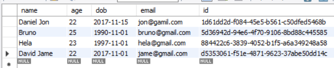
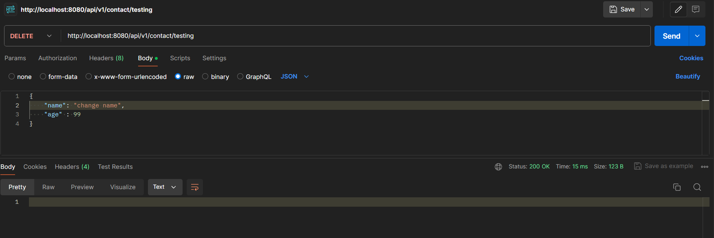

# Assignment 1: Spring Basic Backend

In this assignment, we will create a simple project that applies CRUD (Create, Read, Update, Delete) operations to a contact database. The project will involve creating five APIs to perform the following functions:

1. **Get all data**: Retrieve all contact records from the database.
2. **Get data by ID**: Retrieve a specific contact record using its unique ID.
3. **Post data**: Add a new contact record to the database.
4. **Edit data by ID**: Update an existing contact record using its unique ID.
5. **Delete data by ID**: Remove a specific contact record from the database using its unique ID.

> in this assignment we will try to recreate this project https://github.com/NguyenVanTrieu/spring-crud, you can visit this link for full guide how to recreate this project

## Pre-requirements
To build and run this application locally, you will need the following tools and software installed on your machine:

1. **Install JDK (Java Development Kit)**
   - Ensure you have the JDK installed on your machine. You can download the latest version from the [official Oracle website](https://www.oracle.com/java/technologies/javase-jdk11-downloads.html) or use an open-source alternative like [AdoptOpenJDK](https://adoptopenjdk.net/).

2. **Install a Relational Database Management System (RDBMS)**
   - You can choose any relational database system, such as MySQL, PostgreSQL, or MariaDB. Install the database system of your choice and ensure it is running. Here are some links to the official download pages:
     - [MySQL](https://dev.mysql.com/downloads/)
     - [PostgreSQL](https://www.postgresql.org/download/)
     - [MariaDB](https://mariadb.org/download/)

3. **Integrated Development Environment (IDE)**
   - Use an IDE of your choice that supports Java development. Popular options include:
     - [IntelliJ IDEA](https://www.jetbrains.com/idea/)
     - [Eclipse](https://www.eclipse.org/downloads/)
     - [NetBeans](https://netbeans.apache.org/download/index.html)


4. **Maven**
   - Maven is a build automation tool used for Java projects. Ensure that Maven is installed on your machine. You can download it from the [official Apache Maven website](https://maven.apache.org/download.cgi).

## Database
The database in this project consists of a single table with five columns: `name`, `age`, `dob`, `email`, and `id`. Each column will initially contain four rows of data. Here is the detailed schema:

1. **name**: Stores the name of the contact.
2. **age**: Stores the age of the contact.
3. **dob**: Stores the date of birth of the contact.
4. **email**: Stores the email address of the contact.
5. **id**: Stores the unique identifier for each contact (primary key).



## API explanation

### Mapping

In this project, `@RequestMapping` annotation is used to map web requests to specific handler classes or handler methods. In this context, the annotation `@RequestMapping("/api/v1/contact")` is used to define a base URL for the API endpoints related to the contact resource.

### Get all data

```java
    @GetMapping
    public ResponseEntity<List<Contact>> listAllContact(){
        List<Contact> listContact= contactRepository.findAll();
        if(listContact.isEmpty()) {
            return ResponseEntity.noContent().build();
        }
        return ResponseEntity.ok(listContact);
    }
```

 This api handles HTTP GET requests to retrieve all contacts from the database. It uses `contactRepository.findAll()` to fetch the list of all contacts. If the resulting list is empty, the method returns a `204 No Content` response, indicating that there are no contacts to display. If there are contacts in the list, it returns a `200 OK` response with the list of contacts in the response body.

 

 ### Get data by ID

 ```java
    @GetMapping(value = "/{id}")
    public ResponseEntity<Contact> findContact(@PathVariable("id") String id) {
        Optional<Contact> contactOpt= contactRepository.findById(id);
        if(contactOpt.isPresent()) {
            return ResponseEntity.ok(contactOpt.get());
        }
        return ResponseEntity.notFound().build();
    }
```

This api handles HTTP GET requests to retrieve a specific contact by its ID. The `@PathVariable("id")` annotation indicates that the method parameter `id` should be bound to the value in the URL path. The method uses `contactRepository.findById(id)` to search for the contact. If the contact is found (i.e., the `Optional<Contact>` is present), it returns a `200 OK` response with the contact in the response body. If the contact is not found, it returns a `404 Not Found` response, indicating that no contact with the specified ID exists.


### Input Data

```java
    @PostMapping
    public ResponseEntity<Contact> saveContact(@RequestBody Contact contact) {
        Optional<Contact> contactOpt = contactRepository.findById(contact.getId());
        if(contactOpt.isPresent()) {
            return ResponseEntity.badRequest().build();
        }
        return ResponseEntity.ok(contactRepository.save(contact));
    }
```

This api handles HTTP POST requests to save a new contact. It checks if a contact with the provided ID already exists in the database using `contactRepository.findById(contact.getId())`. If a contact with the same ID is found, it returns a `400 Bad Request` response to prevent duplicates. If no such contact exists, it saves the new contact and returns a `200 OK` response with the saved contact.


### Edit data

```java
    @PutMapping(value = "/{id}")
    public ResponseEntity<Contact> updateContact(@PathVariable(value = "id") String id,
                                                 @RequestBody Contact contactForm) {
        Optional<Contact> contactOpt = contactRepository.findById(id);
        if(contactOpt.isPresent()) {
            Contact contact = contactOpt.get();
            contact.setName(contactForm.getName());
            contact.setAge(contactForm.getAge());

            Contact updatedContact = contactRepository.save(contact);
            return ResponseEntity.ok(updatedContact);
        }
        return ResponseEntity.notFound().build();
    }
```

This api handles HTTP PUT requests to update an existing contact identified by its ID. The `@PathVariable(value = "id")` annotation binds the `id` parameter to the value in the URL path, and the `@RequestBody` annotation binds the request body to a `Contact` object (`contactForm`). The method uses `contactRepository.findById(id)` to check if a contact with the specified ID exists. If found, it updates the contact's details (e.g., name and age) with values from `contactForm` and saves the updated contact using `contactRepository.save(contact)`. It then returns a `200 OK` response with the updated contact. If the contact is not found, it returns a `404 Not Found` response, indicating that no contact with the specified ID exists.


### Delete data by ID

```java
    @DeleteMapping(value = "/{id}")
    public ResponseEntity<Contact> deleteContact(@PathVariable(value = "id") String id) {
        Optional<Contact> contactOpt = contactRepository.findById(id);
        if(contactOpt.isPresent()) {
            contactRepository.delete(contactOpt.get());
            return ResponseEntity.ok().build();

        }
        return ResponseEntity.notFound().build();
    }
```

This api handles HTTP DELETE requests to remove an existing contact identified by its ID. The `@PathVariable(value = "id")` annotation binds the `id` parameter to the value in the URL path. The method uses `contactRepository.findById(id)` to check if a contact with the specified ID exists. If found, it deletes the contact using `contactRepository.delete(contactOpt.get())` and returns a `200 OK` response indicating the deletion was successful. If the contact is not found, it returns a `404 Not Found` response, indicating that no contact with the specified ID exists.





