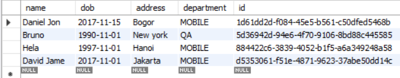
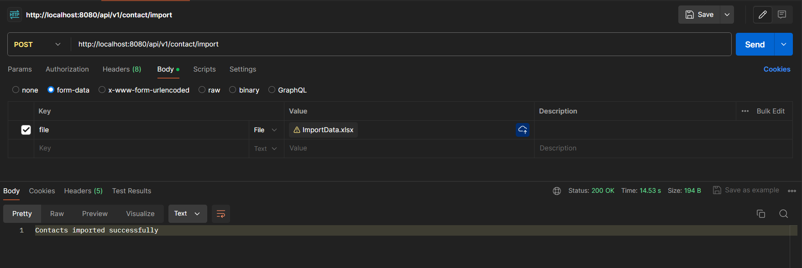
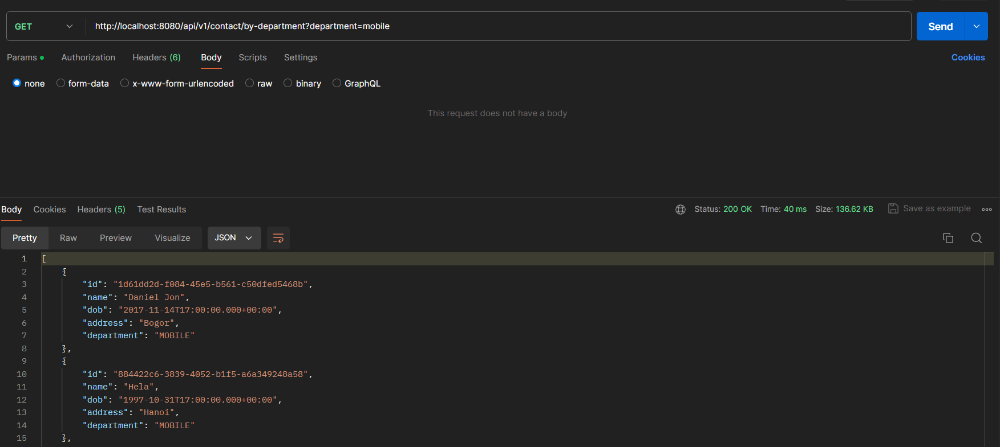

# Assignment 2: CRUD project for manages employee

In this assignment, we will continue from the first assignment to create a simple project that applies CRUD (Create, Read, Update, Delete) operations. However, in this assignment, we will introduce the ability to take a CSV file and add its data to the database. Additionally, we will implement two new APIs:

1. **Input Data from CSV**: This API will allow us to upload a CSV file containing employee data, which will then be added to the database.
2. **Return All Employees from a Specific Department**: This API will retrieve and return all employee records that belong to a specified department.

> You can visit the first assignment here https://github.com/affandyfandy/java-hamdan/tree/main/Week3/Assignment1

## Pre-requirements
To build and run this application locally, you will need the following tools and software installed on your machine:

1. **Install JDK (Java Development Kit)**
   - Ensure you have the JDK installed on your machine. You can download the latest version from the [official Oracle website](https://www.oracle.com/java/technologies/javase-jdk11-downloads.html) or use an open-source alternative like [AdoptOpenJDK](https://adoptopenjdk.net/).

2. **Install a Relational Database Management System (RDBMS)**
   - You can choose any relational database system, such as MySQL, PostgreSQL, or MariaDB. Install the database system of your choice and ensure it is running. Here are some links to the official download pages:
     - [MySQL](https://dev.mysql.com/downloads/)
     - [PostgreSQL](https://www.postgresql.org/download/)
     - [MariaDB](https://mariadb.org/download/)

3. **Integrated Development Environment (IDE)**
   - Use an IDE of your choice that supports Java development. Popular options include:
     - [IntelliJ IDEA](https://www.jetbrains.com/idea/)
     - [Eclipse](https://www.eclipse.org/downloads/)
     - [NetBeans](https://netbeans.apache.org/download/index.html)

4. **Maven**
   - Maven is a build automation tool used for Java projects. Ensure that Maven is installed on your machine. You can download it from the [official Apache Maven website](https://maven.apache.org/download.cgi).

## Database
The database in this project consists of a single table with five columns: `ID`, `Name`, `DateOfBirth`, `Address`, and `Department`. Each column will initially contain four rows of data. Here is the detailed schema:

1. **ID**: Stores the unique identifier for each employee (primary key).
2. **Name**: Stores the name of the employee.
3. **DateOfBirth**: Stores the date of birth of the employee.
4. **Address**: Stores the address of the employee.
5. **Department**: Stores the department to which the employee belongs.(primary key).



## API explanation

### Mapping

Just like in the last project, `@RequestMapping` annotation is used to map web requests to specific handler classes or handler methods and `@RequestMapping("/api/v1/contact")` is used to define a base URL for the API endpoints related to the database resource.

### Input data from CSV

```java
    @PostMapping("/import")
    public ResponseEntity<String> importContactsFromFile(@RequestParam("file") MultipartFile file) {
        if (file.isEmpty()) {
            return ResponseEntity.status(HttpStatus.BAD_REQUEST).body("File is empty");
        }

        SimpleDateFormat dateFormat = new SimpleDateFormat("dd/MM/yyyy");

        try (InputStream is = file.getInputStream();
             Workbook workbook = new XSSFWorkbook(is)) {

            Sheet sheet = workbook.getSheetAt(0);
            for (Row row : sheet) {
                if (row.getRowNum() == 0) {
                    continue; // Skip header row
                }
                Contact contact = new Contact();
                contact.setId(row.getCell(0).getStringCellValue());
                contact.setName(row.getCell(1).getStringCellValue());
                
                Cell dateCell = row.getCell(2);
                if (dateCell != null) {
                    Date dob = null;
                    if (dateCell.getCellType() == CellType.STRING) {
                        dob = dateFormat.parse(dateCell.getStringCellValue());
                    } else if (dateCell.getCellType() == CellType.NUMERIC) {
                        dob = dateCell.getDateCellValue();
                    }
                    contact.setDob(dob);
                }

                contact.setAddress(row.getCell(3).getStringCellValue());
                contact.setDepartment(row.getCell(4).getStringCellValue());
                
                contactRepository.save(contact);
            }
            return ResponseEntity.status(HttpStatus.OK).body("Contacts imported successfully");

        } catch (ParseException e) {
            return ResponseEntity.status(HttpStatus.BAD_REQUEST).body("Date format error: " + e.getMessage());
        } catch (Exception e) {
            return ResponseEntity.status(HttpStatus.INTERNAL_SERVER_ERROR).body("Error processing file: " + e.getMessage());
        }
    }
```

This API handles HTTP POST requests to import data from an uploaded CSV file. This API is pretty complicated so here's a detailed breakdown of the method:

1. **Mapping**:
   - `@PostMapping("/import")`: Maps this method to handle POST requests at the URL path `/import`.
   - `public ResponseEntity<String> importContactsFromFile(@RequestParam("file") MultipartFile file)`: The method accepts a `MultipartFile` parameter named `file`, which represents the uploaded CSV file.

2. **Date Parsing Setup**:
   - A `SimpleDateFormat` object is created to parse dates in the format `dd/MM/yyyy`.

3. **Processing the File**:
     - `InputStream is = file.getInputStream()`: Opens an input stream to read the file.
     - `Workbook workbook = new XSSFWorkbook(is)`: Creates a workbook object to read the Excel file.
     - `Sheet sheet = workbook.getSheetAt(0)`: Accesses the first sheet in the workbook.

4. **Iterating Through Rows**:
     - `if (row.getRowNum() == 0) { continue; }`: Skips the header row.
     - For each subsequent row, a new `Contact` object is created and populated with data from the row's cells.

5. **Error Handling**:
   - If the file is processed successfully, the method returns a `200 OK` response with the message "Contacts imported successfully".
   - `ParseException` is caught and returns a `400 Bad Request` response with a message indicating a date format error.
   - Other exceptions are caught and return a `500 Internal Server Error` response with a message indicating an error



### Return All Employees from a Specific Department

```java
    @GetMapping("/by-department")
    public ResponseEntity<List<Contact>> getContactsByDepartment(@RequestParam("department") String department) {
        List<Contact> contacts = contactRepository.findByDepartment(department);
        if (contacts.isEmpty()) {
            return ResponseEntity.noContent().build();
        }
        return ResponseEntity.ok(contacts);
    }
```

This API handles HTTP GET requests to retrieve all employee data to a specific department. It accepts a `department` parameter from the request, queries the database using `contactRepository.findByDepartment(department)`, and returns the list of matching contacts. If no contacts are found, it responds with `204 No Content`, indicating the absence of records for the specified department. If contacts are found, it returns a `200 OK` response with the list of contacts in the response body.

