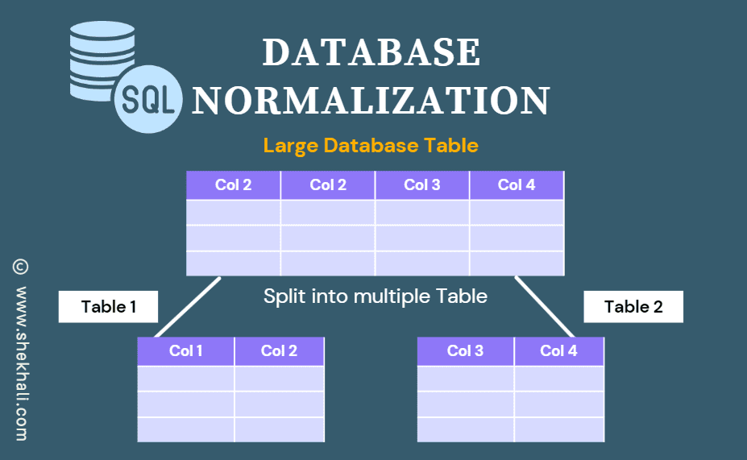

# Assignment 1: Normalization

Database normalization is a process used to organize a database into tables and columns to minimize redundancy and dependency. The goal is to divide large tables into smaller, more manageable pieces without losing data integrity. 

## Benefits of Normalization
- **Reduces Data Redundancy**: Ensures that the same data is not stored in multiple places.
- **Improves Data Integrity**: Ensures that the data is consistent and accurate.
- **Optimizes Queries**: Simplifies the database structure, making it easier to write and understand queries.
- **Facilitates Maintenance**: Makes it easier to modify the database schema when necessary.

## 1. First Normal Form (1NF)
- **Objective**: Ensure that the table has no repeating groups and that each cell contains a single value.

- **Rules**: 
  - Each table cell should contain a single value.
  - Each record needs to be unique.

### Example
Consider a `Students` table before normalization:

| StudentID | Name    | Courses               |
|-----------|---------|-----------------------|
| 1         | Alice   | Math, Science         |
| 2         | Bob     | Math, English         |

This table is not in 1NF because the `Courses` column contains multiple values.

### Normalized to 1NF
To convert it to 1NF, we split the courses into separate rows:

| StudentID | Name    | Course    |
|-----------|---------|-----------|
| 1         | Alice   | Math      |
| 1         | Alice   | Science   |
| 2         | Bob     | Math      |
| 2         | Bob     | English   |

## 2. Second Normal Form (2NF)
 - **Objective**
Ensure that the table is in 1NF and that all non-key attributes are fully functionally dependent on the entire primary key.

- **Rules**: 
  - The table must be in 1NF.
  - All non-key attributes must be fully functionally dependent on the entire primary key 

### Example
Consider a `Students` table in 1NF:

| StudentID | Course    | Instructor |
|-----------|-----------|------------|
| 1         | Math      | Mr. Smith  |
| 1         | Science   | Dr. Jones  |
| 2         | Math      | Mr. Smith  |
| 2         | English   | Mrs. Brown |

Here, `Instructor` is dependent on `Course`, not the combination of `StudentID` and `Course`. This violates 2NF.

### Normalized to 2NF
To convert it to 2NF, we create separate tables:

**Students Table:**
| StudentID | Course    |
|-----------|-----------|
| 1         | Math      |
| 1         | Science   |
| 2         | Math      |
| 2         | English   |

**Courses Table:**
| Course    | Instructor |
|-----------|------------|
| Math      | Mr. Smith  |
| Science   | Dr. Jones  |
| English   | Mrs. Brown |

## 3. Third Normal Form (3NF)
- **Objective**
Ensure that the table is in 2NF and that all the attributes are functionally dependent only on the primary key.

- **Rules**: 
  - The table must be in 2NF.
  - There should be no transitive dependency (non-key attributes should not depend on other non-key attributes).

### Example
Consider the `Students` and `Courses` tables in 2NF:

**Students Table:**
| StudentID | Course    |
|-----------|-----------|
| 1         | Math      |
| 1         | Science   |
| 2         | Math      |
| 2         | English   |

**Courses Table:**
| Course    | Instructor | Department   |
|-----------|------------|--------------|
| Math      | Mr. Smith  | Mathematics  |
| Science   | Dr. Jones  | Science      |
| English   | Mrs. Brown | Humanities   |

Here, `Department` is dependent on `Course`, not the primary key of the `Courses` table (`Course` and `Instructor`). This violates 3NF.

### Normalized to 3NF
To convert it to 3NF, we create separate tables:

**Courses Table:**
| Course    | Instructor |
|-----------|------------|
| Math      | Mr. Smith  |
| Science   | Dr. Jones  |
| English   | Mrs. Brown |

**Departments Table:**
| Course    | Department   |
|-----------|--------------|
| Math      | Mathematics  |
| Science   | Science      |
| English   | Humanities   |
