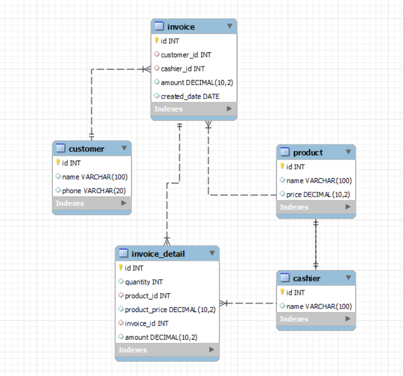

# Assignment 2: Invoice Database

In this assignment we are required to initialize a database for managing invoices and making a mock data for the database. The database consists of the following tables:

- `customer`: Stores customer information.
- `cashier`: Stores cashier information.
- `product`: Stores product information.
- `invoice`: Stores invoice information.
- `invoice_detail`: Stores detailed information about each invoice.

## Database Initialization Script

> *p.s. i'm using mysql, you can change the script according to the DBMS you use

```sql
CREATE TABLE customer (
    id INT AUTO_INCREMENT PRIMARY KEY,
    name VARCHAR(100),
    phone VARCHAR(20)
);

CREATE TABLE cashier (
    id INT AUTO_INCREMENT PRIMARY KEY,
    name VARCHAR(100)
);

CREATE TABLE product (
    id INT AUTO_INCREMENT PRIMARY KEY,
    name VARCHAR(100),
    price DECIMAL(10, 2)
);

CREATE TABLE invoice (
    id INT AUTO_INCREMENT PRIMARY KEY,
    customer_id INT,
    cashier_id INT,
    amount DECIMAL(10, 2),
    created_date DATE,
    FOREIGN KEY (customer_id) REFERENCES customer(id),
    FOREIGN KEY (cashier_id) REFERENCES cashier(id)
);

CREATE TABLE invoice_detail (
    id INT AUTO_INCREMENT PRIMARY KEY,
    quantity INT,
    product_id INT,
    product_price DECIMAL(10, 2),
    invoice_id INT,
    amount DECIMAL(10, 2) GENERATED ALWAYS AS (quantity * product_price) STORED,
    FOREIGN KEY (product_id) REFERENCES product(id),
    FOREIGN KEY (invoice_id) REFERENCES invoice(id)
);
```

## Mock Data Insertion Script


```sql
-- Insert mock data into customer table
INSERT INTO customer (name, phone) VALUES
('John Doe', '123-456-7890'),
('Jane Smith', '987-654-3210'),
('Alice Johnson', '555-555-5555');

-- Insert mock data into cashier table
INSERT INTO cashier (name) VALUES
('Michael Brown'),
('Sarah Davis'),
('Emily White');

-- Insert mock data into product table
INSERT INTO product (name, price) VALUES
('Product A', 10.00),
('Product B', 15.50),
('Product C', 7.25);

-- Insert mock data into invoice table
INSERT INTO invoice (customer_id, cashier_id, amount, created_date) VALUES
(1, 1, 0.00, '2024-06-01'),
(2, 2, 0.00, '2024-06-02'),
(3, 3, 0.00, '2024-06-03');

-- Insert mock data into invoice_detail table
INSERT INTO invoice_detail (quantity, product_id, product_price, invoice_id) VALUES
(2, 1, 10.00, 1),
(1, 2, 15.50, 1),
(3, 3, 7.25, 2),
(1, 1, 10.00, 3),
(4, 2, 15.50, 3);
```

## Updating Invoice Amounts

To ensure the `amount` in the `invoice` table reflects the sum of the related `invoice_detail` amounts, use the following script. Note that you may need to disable `safe update mode` temporarily to perform this operation:

```sql
-- Disable safe update mode
SET SQL_SAFE_UPDATES = 0;

-- Update invoice amounts
UPDATE invoice
SET amount = (SELECT SUM(amount) FROM invoice_detail WHERE invoice_id = invoice.id);

-- Re-enable safe update mode
SET SQL_SAFE_UPDATES = 1;
```

## Entity Relationship Diagram

After running the script above, your ERD should be looking like this:


## Explanation

1. **Table Creation**:
    - `customer`, `cashier`, `product`, `invoice`, and `invoice_detail` tables are created with `AUTO_INCREMENT` primary keys.
    - Foreign key constraints are added to ensure referential integrity between `invoice` and `customer`, `cashier` tables, and between `invoice_detail` and `invoice`, `product` tables.

2. **Mock Data Insertion**:
    - Sample data is inserted into the `customer`, `cashier`, `product`, `invoice`, and `invoice_detail` tables.

3. **Updating Invoice Amounts**:
    - The `amount` field in the `invoice` table is updated to reflect the sum of the amounts in the `invoice_detail` table for each invoice.
    - Safe update mode is temporarily disabled to allow the update operation without specifying a key column in the `WHERE` clause.
