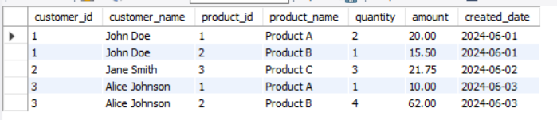
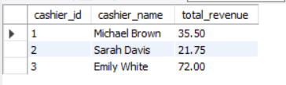
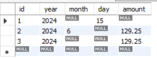

# Assignment 3: Query

In this assignment based on the previous assignment, we will make some query such ass view list of products customers has bought, create function Calculating Revenue by Cashier and procedure to calculate store revenue per day, month and year.

> *p.s. i'm using mysql, you can change the script according to the DBMS you use

## View to Show List of Products Customers Bought:

The view customer_purchases is designed to provide a comprehensive list of products that customers have bought, including relevant details such as customer information, product information, purchase quantity, total amount, and the date of the transaction.

### Script to Create the View:

```sql
CREATE VIEW customer_purchases AS
SELECT 
    c.id AS customer_id,
    c.name AS customer_name,
    p.id AS product_id,
    p.name AS product_name,
    id.quantity,
    id.amount,
    i.created_date
FROM 
    invoice_detail id
JOIN 
    invoice i ON id.invoice_id = i.id
JOIN 
    customer c ON i.customer_id = c.id
JOIN 
    product p ON id.product_id = p.id;
```

### Output

To see the table that we created from this View, you can use the following script:
```sql
SELECT * FROM <YOUR_DATABASE>.customer_purchases;
```


## Create a Function Calculating Revenue by Cashier:

The function calculate_revenue_by_cashier is designed to calculate the total revenue generated by a specific cashier based on their cashier ID. This function sums up the amounts of all invoices handled by a particular cashier.

### SQL to Create the Function:

```sql
DELIMITER //

CREATE FUNCTION calculate_revenue_by_cashier(input_cashier_id INT) 
RETURNS DECIMAL(10, 2)
READS SQL DATA
BEGIN
    DECLARE total_revenue DECIMAL(10, 2);
    
    SELECT SUM(i.amount) INTO total_revenue
    FROM invoice i
    WHERE i.cashier_id = input_cashier_id;
    
    RETURN total_revenue;
END //

DELIMITER ;
```

### How to Use the Function:

Now to use the function `calculate_revenue_by_cashier`, you can call it in a `SELECT` statement and provide the `cashier_id` as an argument. Let's see the revenue for all cashiers with this query:

```sql
SELECT 
    c.id AS cashier_id, 
    c.name AS cashier_name, 
    calculate_revenue_by_cashier(c.id) AS total_revenue
FROM 
    cashier c;
```


## Create Stored Procedures to Calculate revenue per Date:

### Create `revenue_report` Table

The `revenue_report` table is designed to store the revenue information calculated for different time periods such as day, month, and year. To create this table you can use this script:
```sql
CREATE TABLE revenue_report (
    id INT AUTO_INCREMENT PRIMARY KEY,
    year INT,
    month INT,
    day INT,
    amount DECIMAL(10, 2)
);
```

### 1. Revenue of Day

> Input: day of year

```sql
DELIMITER //

CREATE PROCEDURE calculate_revenue_of_day(input_year INT, input_day_of_year INT)
BEGIN
    DECLARE total_revenue DECIMAL(10, 2);
    
    SELECT SUM(amount) INTO total_revenue
    FROM invoice
    WHERE YEAR(created_date) = input_year AND DAYOFYEAR(created_date) = input_day_of_year;
    
    INSERT INTO revenue_report (year, month, day, amount)
    VALUES (input_year, NULL, input_day_of_year, total_revenue);
END //

DELIMITER ;
```

### 2. Revenue of Month

> Input: month of year

```sql
DELIMITER //

CREATE PROCEDURE calculate_revenue_of_month(input_year INT, input_month INT)
BEGIN
    DECLARE total_revenue DECIMAL(10, 2);
    
    SELECT SUM(amount) INTO total_revenue
    FROM invoice
    WHERE YEAR(created_date) = input_year AND MONTH(created_date) = input_month;
    
    INSERT INTO revenue_report (year, month, day, amount)
    VALUES (input_year, input_month, NULL, total_revenue);
END //

DELIMITER ;
```

### 3. Revenue of Year

> Input: year

```sql
DELIMITER //

CREATE PROCEDURE calculate_revenue_of_year(input_year INT)
BEGIN
    DECLARE total_revenue DECIMAL(10, 2);
    
    SELECT SUM(amount) INTO total_revenue
    FROM invoice
    WHERE YEAR(created_date) = input_year;
    
    INSERT INTO revenue_report (year, month, day, amount)
    VALUES (input_year, NULL, NULL, total_revenue);
END //

DELIMITER ;
```

### Usage of Stored Procedures:

You can call these stored procedures with the appropriate parameters to calculate and store the revenue data in the `revenue_report` table.

- To calculate the revenue of the 15th day of 2024:
    ```sql
    CALL calculate_revenue_of_day(2024, 15);
    ```

- To calculate the revenue of June 2024:
    ```sql
    CALL calculate_revenue_of_month(2024, 6);
    ```

- To calculate the revenue of the year 2024:
    ```sql
    CALL calculate_revenue_of_year(2024);
    ```

These stored procedures will insert the calculated revenue into the `revenue_report` table based on the given parameters.

