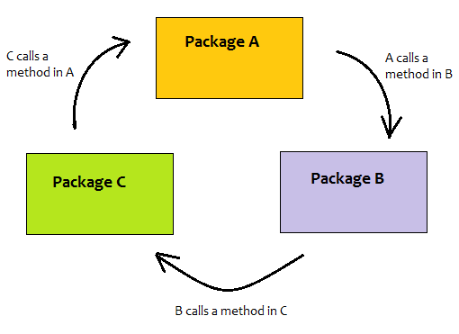

# Number 1: Working with Annotations

This assignment demonstrates the creation of an `EmailService` interface and its implementation, and using this service within an `EmployeeService` class with Dependency Injection (DI) demonstrated in three ways: constructor, field, and setter injection.

## Step 1: Create `EmailService` Interface and `EmailServiceImpl` Implementation

### EmailService Interface

Define an interface named `EmailService` with a method to send emails.

```java
package com.example.service;

public interface EmailService {
    void sendEmail(String to, String subject, String body);
}
```

### EmailServiceImpl Implementation

Implement the `EmailService` interface in a class named `EmailServiceImpl`.

```java
package com.example.service;

import org.springframework.stereotype.Service;

@Service
public class EmailServiceImpl implements EmailService {

    @Override
    public void sendEmail(String to, String subject, String body) {
        // Simulate sending email
        System.out.println("Sending email to " + to);
        System.out.println("Subject: " + subject);
        System.out.println("Body: " + body);
    }
}
```

**Explanation**:
- `@Service`: This annotation marks the class as a service component in Spring, allowing it to be detected during component scanning and registered as a Spring bean.
- The `sendEmail` method provides the implementation for sending emails.

## Step 2: Create `EmployeeService` Class Using `EmailService` with DI

### EmployeeService Class

Create a class named `EmployeeService` that uses `EmailService` to send emails to employees. We'll demonstrate DI using constructor, field, and setter injection.

```java
package com.example.service;

import org.springframework.beans.factory.annotation.Autowired;
import org.springframework.stereotype.Service;

@Service
public class EmployeeService {

    private EmailService emailService;

    // Constructor Injection
    @Autowired
    public EmployeeService(EmailService emailService) {
        this.emailService = emailService;
    }

    // Field Injection
    @Autowired
    private EmailService fieldInjectedEmailService;

    // Setter Injection
    private EmailService setterInjectedEmailService;

    @Autowired
    public void setEmailService(EmailService emailService) {
        this.setterInjectedEmailService = emailService;
    }

    public void notifyEmployeeByEmail(String email, String subject, String message) {
        // Using Constructor Injection
        emailService.sendEmail(email, subject, message);

        // Using Field Injection
        fieldInjectedEmailService.sendEmail(email, subject, message);

        // Using Setter Injection
        setterInjectedEmailService.sendEmail(email, subject, message);
    }
}
```

**Explanation**:
- `@Autowired`: This annotation on the constructor, field, and setter methods allows Spring to resolve and inject the collaborating `EmailService` bean into the `EmployeeService`.
- Constructor Injection: The `EmailService` dependency is injected through the constructor.
- Field Injection: The `EmailService` dependency is injected directly into the field.
- Setter Injection: The `EmailService` dependency is injected via a setter method.


## Application Configuration

Ensure your application is properly configured to use Spring Framework's component scanning.

### Spring Configuration

Add the following configuration to ensure that Spring scans the package for components.

```java
package com.example;

import org.springframework.context.annotation.ComponentScan;
import org.springframework.context.annotation.Configuration;

@Configuration
@ComponentScan(basePackages = "com.example")
public class AppConfig {
}
```

**Explanation**:
- `@Configuration`: Indicates that the class contains Spring configuration.
- `@ComponentScan`: Configures the base packages to scan for Spring components.

## Running the Application

Create a main class to run your Spring application.

```java
package com.example;

import org.springframework.context.annotation.AnnotationConfigApplicationContext;
import com.example.service.EmployeeService;

public class Application {
    public static void main(String[] args) {
        AnnotationConfigApplicationContext context = 
            new AnnotationConfigApplicationContext(AppConfig.class);

        EmployeeService employeeService = context.getBean(EmployeeService.class);
        employeeService.notifyEmployeeByEmail("employee@example.com", "Work Update", "This is a work update message.");

        context.close();
    }
}
```

**Explanation**:
- This class initializes the Spring application context and retrieves the `EmployeeService` bean to demonstrate sending emails using the injected `EmailService`.


**Output**
```
Sending email to employee@example.com
Subject: Work Update
Body: This is a work update message.
Sending email to employee@example.com
Subject: Work Update
Body: This is a work update message.
Sending email to employee@example.com
Subject: Work Update
Body: This is a work update message.
```

# Number 2 : Comparison of Dependency Injection Types

From the implementation above, we have used three types of Dependency Injection: Constructor Injection, Field Injection, and Setter Injection. Below is a comparison of these three types.

| Aspect                | Constructor Injection                     | Field Injection                          | Setter Injection                        |
|-----------------------|-------------------------------------------|------------------------------------------|-----------------------------------------|
| **Definition**        | Dependency is injected via the constructor.| Dependency is injected directly into a field. | Dependency is injected via a setter method. |
| **Advantages**        | - Ensures all dependencies are injected when the object is created. <br> - Promotes immutability. | - Simple and concise. <br> - Less boilerplate code. | - Allows for optional dependencies. <br> - Can be used to change dependencies after object creation. |
| **Disadvantages**     | Can lead to constructor bloat if there are many dependencies. | - Breaks encapsulation by making fields accessible to the framework. <br> - Difficult to perform unit testing. | Can leave the object in an inconsistent state if not called. |
| **Usage**             | `@Autowired` on the constructor.          | `@Autowired` directly on the field.      | `@Autowired` on the setter method.      |
| **Best Practice**     | Recommended for mandatory dependencies and better testability. | Not recommended due to encapsulation issues and testability concerns. | Recommended for optional dependencies.  |

## Conclusion

### Which one is better?

- **Constructor Injection** is generally considered the best practice for mandatory dependencies because it ensures that the dependency is available when the object is created, promoting immutability and making the code easier to test.

### Which one is recommended?

- **Constructor Injection** is recommended for most cases, especially for mandatory dependencies.
- **Setter Injection** can be useful for optional dependencies or when you need to change the dependency after object creation.
- **Field Injection** is typically not recommended due to its negative impact on encapsulation and testability, although it can be used for simplicity in some cases.

# Number 3: Circular Dependency Injection


## What is Circular Dependency Injection?

Circular dependency injection occurs when two or more beans in a dependency injection framework (like Spring) depend on each other. For example, if `ClassA` depends on `ClassB`, and `ClassB` depends on `ClassA`, a circular dependency is created.

## Example of Circular Dependency

Imagine we have the following classes:

```java
public class ClassA {
    private ClassB classB;

    @Autowired
    public ClassA(@Lazy ClassB classB) {
        this.classB = classB;
    }
}

public class ClassB {
    private ClassA classA;

    @Autowired
    public ClassB(@Lazy ClassA classA) {
        this.classA = classA;
    }
}
```

In this scenario, Spring cannot resolve the dependencies because it gets stuck in an infinite loop trying to create an instance of `ClassA` and `ClassB`.

## Solutions to Circular Dependency

### 1. Setter Injection

One way to solve circular dependencies is to use setter injection instead of constructor injection. This allows Spring to create the beans first and then inject dependencies.

```java
public class ClassA {
    private ClassB classB;

    @Autowired
    public void setClassB(ClassB classB) {
        this.classB = classB;
    }
}

public class ClassB {
    private ClassA classA;

    @Autowired
    public void setClassA(ClassA classA) {
        this.classA = classA;
    }
}
```

### 2. `@Lazy` Annotation

Another approach is to use the `@Lazy` annotation. This annotation tells Spring to inject the dependency lazily, meaning it will create the bean only when it is first requested.

```java
public class ClassA {
    private ClassB classB;

    @Autowired
    public ClassA(@Lazy ClassB classB) {
        this.classB = classB;
    }
}

public class ClassB {
    private ClassA classA;

    @Autowired
    public ClassB(@Lazy ClassA classA) {
        this.classA = classA;
    }
}
```

### 3. Use Interfaces

Using interfaces to break the dependency chain can also resolve circular dependencies. This can help to decouple the classes and avoid direct dependencies.

```java
public interface InterfaceA {
    void methodA();
}

public interface InterfaceB {
    void methodB();
}

public class ClassA implements InterfaceA {
    private InterfaceB interfaceB;

    @Autowired
    public ClassA(InterfaceB interfaceB) {
        this.interfaceB = interfaceB;
    }

    @Override
    public void methodA() {
        // Implementation example
    }
}

public class ClassB implements InterfaceB {
    private InterfaceA interfaceA;

    @Autowired
    public ClassB(InterfaceA interfaceA) {
        this.interfaceA = interfaceA;
    }

    @Override
    public void methodB() {
        // Implementation exampple
    }
}
```

# Number 4: Explanation and Examples of Spring Annotations

## @Configuration
- **Explanation**: Indicates that the class can be used by the Spring IoC container as a source of bean definitions.
- **Example**:
  ```java
  @Configuration
  public class AppConfig {
      @Bean
      public MyBean myBean() {
          return new MyBean();
      }
  }

  public class MyBean {
      public void doSomething() {
          System.out.println("MyBean is doing something!");
      }
  }

  public static void main(String[] args) {
      ApplicationContext context = new AnnotationConfigApplicationContext(AppConfig.class);
      MyBean myBean = context.getBean(MyBean.class);
      myBean.doSomething();
  }
  ```
- **Output**:
  ```plaintext
  MyBean is doing something!
  ```

## @Bean
- **Explanation**: Indicates that a method produces a bean to be managed by the Spring container.
- **Example**: Same as above.
- **Output**: Same as above.

## @ComponentScan
- **Explanation**: Configures component scanning directives for use with @Configuration classes.
- **Example**:
  ```java
  @Configuration
  @ComponentScan(basePackages = "com.example")
  public class AppConfig {
  }

  @Component
  public class MyComponent {
      public void doSomething() {
          System.out.println("MyComponent is doing something!");
      }
  }

  public static void main(String[] args) {
      ApplicationContext context = new AnnotationConfigApplicationContext(AppConfig.class);
      MyComponent myComponent = context.getBean(MyComponent.class);
      myComponent.doSomething();
  }
  ```
- **Output**:
  ```plaintext
  MyComponent is doing something!
  ```

## @Component
- **Explanation**: Indicates that an annotated class is a "component". Such classes are considered as candidates for auto-detection when using annotation-based configuration and classpath scanning.
- **Example**: Same as above.
- **Output**: Same as above.

## @Service
- **Explanation**: Indicates that an annotated class is a "Service". This annotation is a specialization of @Component.
- **Example**:
  ```java
  @Service
  public class MyService {
      public void doSomething() {
          System.out.println("MyService is doing something!");
      }
  }

  @Configuration
  @ComponentScan(basePackages = "com.example")
  public class AppConfig {
  }

  public static void main(String[] args) {
      ApplicationContext context = new AnnotationConfigApplicationContext(AppConfig.class);
      MyService myService = context.getBean(MyService.class);
      myService.doSomething();
  }
  ```
- **Output**:
  ```plaintext
  MyService is doing something!
  ```

## @Repository
- **Explanation**: Indicates that an annotated class is a "Repository". This annotation is a specialization of @Component.
- **Example**:
  ```java
  @Repository
  public class MyRepository {
      public void doSomething() {
          System.out.println("MyRepository is doing something!");
      }
  }

  @Configuration
  @ComponentScan(basePackages = "com.example")
  public class AppConfig {
  }

  public static void main(String[] args) {
      ApplicationContext context = new AnnotationConfigApplicationContext(AppConfig.class);
      MyRepository myRepository = context.getBean(MyRepository.class);
      myRepository.doSomething();
  }
  ```
- **Output**:
  ```plaintext
  MyRepository is doing something!
  ```

## @Autowired
- **Explanation**: Marks a constructor, field, setter method, or config method to be autowired by Spring's dependency injection facilities.
- **Example**:
  ```java
  @Component
  public class MyComponent {
      private MyService myService;

      @Autowired
      public MyComponent(MyService myService) {
          this.myService = myService;
      }

      public void doSomething() {
          myService.doSomething();
      }
  }

  @Service
  public class MyService {
      public void doSomething() {
          System.out.println("MyService is doing something!");
      }
  }

  @Configuration
  @ComponentScan(basePackages = "com.example")
  public class AppConfig {
  }

  public static void main(String[] args) {
      ApplicationContext context = new AnnotationConfigApplicationContext(AppConfig.class);
      MyComponent myComponent = context.getBean(MyComponent.class);
      myComponent.doSomething();
  }
  ```
- **Output**:
  ```plaintext
  MyService is doing something!
  ```

## @Scope
- **Explanation**: Configures the scope of the bean. Common scopes are "singleton" and "prototype".
- **Example**:
  ```java
  @Component
  @Scope("prototype")
  public class MyPrototypeBean {
      public void doSomething() {
          System.out.println("MyPrototypeBean is doing something!");
      }
  }

  @Configuration
  @ComponentScan(basePackages = "com.example")
  public class AppConfig {
  }

  public static void main(String[] args) {
      ApplicationContext context = new AnnotationConfigApplicationContext(AppConfig.class);
      MyPrototypeBean bean1 = context.getBean(MyPrototypeBean.class);
      MyPrototypeBean bean2 = context.getBean(MyPrototypeBean.class);
      bean1.doSomething();
      bean2.doSomething();
      System.out.println(bean1 == bean2); // Should print false
  }
  ```
- **Output**:
  ```plaintext
  MyPrototypeBean is doing something!
  MyPrototypeBean is doing something!
  false
  ```

## @Qualifier
- **Explanation**: Indicates a specific bean to be injected when multiple beans of the same type are present.
- **Example**:
  ```java
  @Component
  public class MyComponent {
      private MyBean myBean;

      @Autowired
      public MyComponent(@Qualifier("specificBean") MyBean myBean) {
          this.myBean = myBean;
      }

      public void doSomething() {
          myBean.doSomething();
      }
  }

  @Component("specificBean")
  public class MySpecificBean implements MyBean {
      @Override
      public void doSomething() {
          System.out.println("MySpecificBean is doing something!");
      }
  }

  @Component("anotherBean")
  public class MyAnotherBean implements MyBean {
      @Override
      public void doSomething() {
          System.out.println("MyAnotherBean is doing something!");
      }
  }

  public interface MyBean {
      void doSomething();
  }

  @Configuration
  @ComponentScan(basePackages = "com.example")
  public class AppConfig {
  }

  public static void main(String[] args) {
      ApplicationContext context = new AnnotationConfigApplicationContext(AppConfig.class);
      MyComponent myComponent = context.getBean(MyComponent.class);
      myComponent.doSomething();
  }
  ```
- **Output**:
  ```plaintext
  MySpecificBean is doing something!
  ```

## @PropertySource, @Value
- **Explanation**: 
  - `@PropertySource` is used to specify the location of a properties file to be used by the Spring Environment.
  - `@Value` is used to inject values from a properties file into fields.
- **Example**:
  ```java
  @Configuration
  @PropertySource("classpath:application.properties")
  public class AppConfig {
      @Value("${my.property}")
      private String myProperty;

      @Bean
      public MyBean myBean() {
          return new MyBean(myProperty);
      }
  }

  public class MyBean {
      private String myProperty;

      public MyBean(String myProperty) {
          this.myProperty = myProperty;
      }

      public void doSomething() {
          System.out.println("My property value: " + myProperty);
      }
  }

  public static void main(String[] args) {
      ApplicationContext context = new AnnotationConfigApplicationContext(AppConfig.class);
      MyBean myBean = context.getBean(MyBean.class);
      myBean.doSomething();
  }
  ```
- **Output**:
  ```plaintext
  My property value: someValueFromPropertiesFile
  ```

## @PreDestroy, @PostConstruct
- **Explanation**: 
  - `@PostConstruct` is used on a method that needs to be executed after dependency injection is done to perform any initialization.
  - `@PreDestroy` is used on methods as a callback notification to signal that the instance is in the process of being removed by the container.
- **Example**:
  ```java
  @Component
  public class MyComponent {
      @PostConstruct
      public void init() {
          System.out.println("Initialization code");
      }

      @PreDestroy
      public void destroy() {
          System.out.println("Cleanup code");
      }

      public void doSomething() {
          System.out.println("MyComponent is doing something!");
      }
  }

  @Configuration
  @ComponentScan(basePackages = "com.example")
  public class AppConfig {
  }

  public static void main(String[] args) {
      AnnotationConfigApplicationContext context = new AnnotationConfigApplicationContext(AppConfig.class);
      MyComponent myComponent = context.getBean(MyComponent.class);
      myComponent.doSomething();
      context.close();
  }
  ```
- **Output**:
  ```plaintext
  Initialization code
  MyComponent is doing something!
  Cleanup code
  ```

