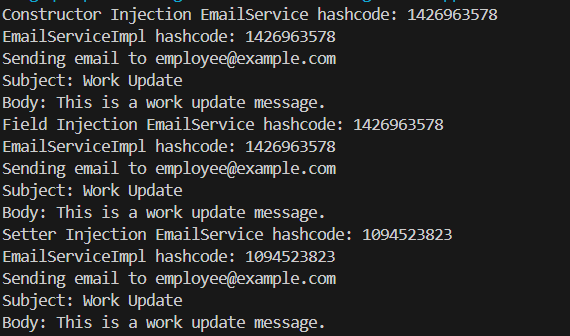
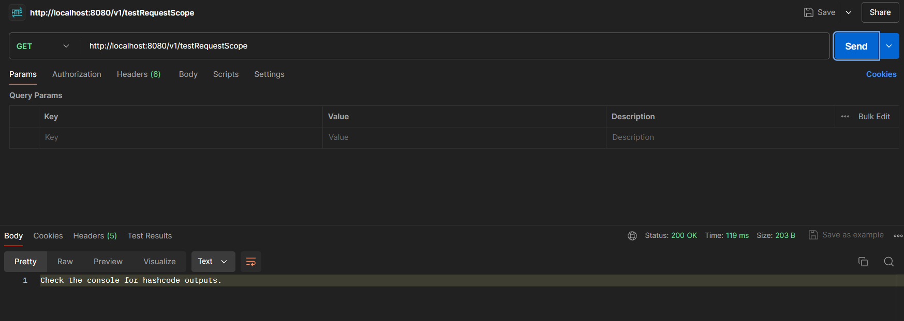
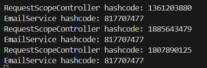

# Number 1: Add Bean Scopes to Assignments 2

To add bean scopes (singleton, prototype) to your existing setup in Assignment 2 and print output to see the scope of beans, you can follow these steps:

- Modify the `AppConfig` class to include bean scope definitions.

- Update the `EmployeeService` and `EmailServiceImpl` classes to print the hashcode of the bean instances to verify their scope.

## Update `AppConfig' class
In this step, we define two beans in the `AppConfig` class using the `@Bean` annotation, one with a singleton scope and the other with a prototype scope. This configuration tells Spring to create a single instance of the `singletonEmailService` bean and a new instance each time the `prototypeEmailService` bean is requested.


```java
package lecture7.assignment3;

import org.springframework.context.annotation.Bean;
import org.springframework.context.annotation.ComponentScan;
import org.springframework.context.annotation.Configuration;
import org.springframework.context.annotation.Scope;
import lecture7.assignment3.service.EmailServiceImpl;

@Configuration
@ComponentScan(basePackages = "lecture7.assignment3")
public class AppConfig {

    @Bean
    @Scope("singleton")
    public EmailServiceImpl singletonEmailService() {
        return new EmailServiceImpl();
    }

    @Bean
    @Scope("prototype")
    public EmailServiceImpl prototypeEmailService() {
        return new EmailServiceImpl();
    }
}
```

## Update `EmployeeService' class

We update the `EmployeeService` class to demonstrate three types of dependency injection: constructor, field, and setter. By using `@Autowired` and `@Qualifier` annotations, we inject the singleton and prototype beans into different fields and methods. We also print the hashcodes of these injected beans to observe their scope during runtime.


```java
package lecture7.assignment3.service;

import org.springframework.beans.factory.annotation.Autowired;
import org.springframework.beans.factory.annotation.Qualifier;
import org.springframework.stereotype.Service;

@Service
public class EmployeeService {

    private EmailService emailService;

    // Constructor Injection
    @Autowired
    public EmployeeService(EmailService emailService) {
        this.emailService = emailService;
    }

    // Field Injection
    @Autowired
    @Qualifier("singletonEmailService")
    private EmailService fieldInjectedEmailService;

    // Setter Injection
    private EmailService setterInjectedEmailService;

    @Autowired
    public void setEmailService(@Qualifier("prototypeEmailService") EmailService emailService) {
        this.setterInjectedEmailService = emailService;
    }

    public void notifyEmployeeByEmail(String email, String subject, String message) {
        // Using Constructor Injection
        System.out.println("Constructor Injection EmailService hashcode: " + emailService.hashCode());
        emailService.sendEmail(email, subject, message);

        // Using Field Injection
        System.out.println("Field Injection EmailService hashcode: " + fieldInjectedEmailService.hashCode());
        fieldInjectedEmailService.sendEmail(email, subject, message);

        // Using Setter Injection
        System.out.println("Setter Injection EmailService hashcode: " + setterInjectedEmailService.hashCode());
        setterInjectedEmailService.sendEmail(email, subject, message);
    }
}
```

## Update `EmailServiceImpl' class

In this step, we modify the `EmailServiceImpl` class to print its hashcode within the `sendEmail` method. This helps us identify the actual instance being used when the method is called, which is crucial for verifying the singleton and prototype behavior.


```java
package lecture7.assignment3.service;

import org.springframework.stereotype.Service;

@Service
public class EmailServiceImpl implements EmailService {

    @Override
    public void sendEmail(String to, String subject, String body) {
        // Simulate sending email
        System.out.println("EmailServiceImpl hashcode: " + this.hashCode());
        System.out.println("Sending email to " + to);
        System.out.println("Subject: " + subject);
        System.out.println("Body: " + body);
    }
}
```

## Update `Application' class
Finally, we update the `Application` class to initialize the Spring context with `AppConfig`, retrieve the `EmployeeService` bean, and call the `notifyEmployeeByEmail` method. This setup ensures that the different types of injected `EmailService` beans are used, and their hashcodes are printed to the console, allowing us to verify the bean scopes.


```java
package lecture7.assignment3;

import org.springframework.context.annotation.AnnotationConfigApplicationContext;
import lecture7.assignment3.service.EmployeeService;

public class Application {
    public static void main(String[] args) {
        AnnotationConfigApplicationContext context = 
            new AnnotationConfigApplicationContext(AppConfig.class);

        EmployeeService employeeService = context.getBean(EmployeeService.class);
        employeeService.notifyEmployeeByEmail("employee@example.com", "Work Update", "This is a work update message.");

        context.close();
    }
}
```
## Output



**Explanation**:

- **Constructor Injection EmailService hashcode: 1426963578**: Indicates that the constructor-injected `EmailService` bean is a singleton (same instance as field-injected).
- **Field Injection EmailService hashcode: 1426963578**: Indicates that the field-injected `EmailService` bean is also the singleton instance.
- **Setter Injection EmailService hashcode: 1094523823**: Indicates that the setter-injected `EmailService` bean is a prototype (different instance each time).

Each call to `sendEmail` within the `notifyEmployeeByEmail` method also prints the hashcode of the `EmailServiceImpl` instance, confirming whether it is the same or different instance based on the scope.

You should see the hashcodes for the constructor and field injection being the same (since they both use the singleton bean), while the setter injection hashcode should be different (since it uses the prototype bean). This verifies the singleton and prototype behavior as configured.

# Number 2 : Request Scope Controller and Testing

To create a controller with request scope and test it, we need to do 2 things:

- **Define a Controller with Request Scope**: Use the `@Scope` annotation with the `WebApplicationContext.SCOPE_REQUEST` value to define the request scope for your controller.

- **Create a Simple Test**: We can use like Postman or a simple test class to test the request scope of your controller.

## Step 1: Define a Controller with Request Scope

Create a controller class and annotate it with `@RestController` and `@Scope("request")`. 

```java
package lecture7.assignment3.controller;

import org.springframework.beans.factory.annotation.Autowired;
import org.springframework.context.annotation.Scope;
import org.springframework.web.bind.annotation.GetMapping;
import org.springframework.web.bind.annotation.RestController;
import org.springframework.web.context.WebApplicationContext;

import lecture7.assignment3.service.EmailService;

@RestController
@Scope(WebApplicationContext.SCOPE_REQUEST)
public class RequestScopeController {

    @Autowired
    private EmailService emailService;

    @GetMapping("/v1/testRequestScope")
    public String testRequestScope() {
        // Print hashcode to verify request scope
        System.out.println("RequestScopeController hashcode: " + this.hashCode());
        System.out.println("EmailService hashcode: " + emailService.hashCode());
        return "Check the console for hashcode outputs.";
    }
}
```

## Step 2: Test it with Postman

You can use Postman or a similar tool to make multiple requests to the `/v1/testRequestScope` endpoint and observe the hashcodes in the console.

1. Start your Spring Boot application.
2. Open Postman and create a new GET request to `http://localhost:8080/v1/testRequestScope`.
3. Send the request multiple times and check the console output each time.


## Expected Output

When you make multiple requests to the `/testRequestScope` endpoint, you should see different hashcodes for each request in the console, indicating that a new instance of the `RequestScopeController` and the `EmailService` bean is created for each request.



This output verifies that the controller and the injected `EmailService` bean are indeed request-scoped.

# Number 3: # Injecting a Prototype Bean into a Singleton Bean

Injecting a prototype bean into a singleton bean requires special handling because the singleton bean is only instantiated once, while the prototype bean is intended to be created anew each time it is requested. Here are a few methods to achieve this:

## 1. Using `@Lookup` Annotation

The `@Lookup` annotation is a Spring-specific feature that allows the framework to override a method at runtime to return a bean from the application context. This method is useful when you need a new instance of a prototype bean each time the method is called.

### How It Works:
- When you annotate a method with `@Lookup`, Spring will override this method to return a new instance of the specified bean.
- This way, each time you call this method, a new instance of the prototype-scoped bean is retrieved.

### Example:
```java
@Service
public class SingletonService {

    public void doSomething() {
        PrototypeService prototypeService = getPrototypeService();
        System.out.println("PrototypeService hashcode: " + prototypeService.hashCode());
    }

    @Lookup
    protected PrototypeService getPrototypeService() {
        // Spring will override this method to return a prototype bean
        return null;
    }
}
```

## 2. Using `ObjectFactory`

The `ObjectFactory` interface provides a way to lazily access a bean from the Spring context. It's useful when you need to retrieve a bean at runtime rather than at the time of dependency injection.

### How It Works:
- `ObjectFactory` is a simple factory interface that you can use to get a bean instance from the Spring context.
- By injecting an `ObjectFactory<PrototypeService>`, you can call `getObject()` to obtain a new instance of the prototype bean each time you need it.

### Example:
```java
@Service
public class SingletonService {

    @Autowired
    @Qualifier("prototypeService")
    private ObjectFactory<PrototypeService> prototypeServiceFactory;

    public void doSomething() {
        PrototypeService prototypeService = prototypeServiceFactory.getObject();
        System.out.println("PrototypeService hashcode: " + prototypeService.hashCode());
    }
}
```

## 3. Using `Provider`

The `Provider` interface from `javax.inject` (also supported by Spring) is another way to lazily retrieve beans. It functions similarly to `ObjectFactory`.

### How It Works:
- `Provider` is an interface that allows you to retrieve a new instance of a bean each time the `get()` method is called.
- By injecting a `Provider<PrototypeService>`, you can call `get()` to obtain a new instance of the prototype bean whenever needed.

### Example:
```java
@Service
public class SingletonService {

    @Autowired
    @Qualifier("prototypeService")
    private Provider<PrototypeService> prototypeServiceProvider;

    public void doSomething() {
        PrototypeService prototypeService = prototypeServiceProvider.get();
        System.out.println("PrototypeService hashcode: " + prototypeService.hashCode());
    }
}
```

## Summary of Differences

| Method          | Description                                                                                          | Use Case                                      |
|-----------------|------------------------------------------------------------------------------------------------------|-----------------------------------------------|
| `@Lookup`       | Overrides a method to return a new prototype instance each time it is called.                        | Simple to use, directly supported by Spring.  |
| `ObjectFactory` | Provides a way to lazily obtain a bean instance from the Spring context.                             | Flexible and less intrusive.                  |
| `Provider`      | A standard interface from `javax.inject` that allows retrieving a new bean instance on each request. | Adheres to standard dependency injection.     |

# Number 4: Difference between `BeanFactory` and `ApplicationContext`

| Feature                              | `BeanFactory`                                                                                  | `ApplicationContext`                                                                            |
|--------------------------------------|-----------------------------------------------------------------------------------------------|------------------------------------------------------------------------------------------------|
| **Definition**                       | Basic container providing basic dependency injection.                                          | Advanced container providing enterprise-specific functionality.                                 |
| **Eager Initialization**             | No, initializes beans lazily (on demand).                                                      | Yes, initializes singleton beans eagerly (on startup).                                          |
| **Event Handling**                   | No built-in event handling.                                                                    | Supports event handling via the ApplicationEventPublisher interface.                            |
| **Internationalization**             | No built-in support for internationalization (i18n).                                           | Provides support for internationalization (i18n) through the MessageSource interface.           |
| **Type of Configuration**            | Simple configuration and lightweight container.                                                | More complex configuration, suitable for large-scale enterprise applications.                   |
| **BeanPostProcessor and BeanFactoryPostProcessor** | Must be registered manually.                                                        | Automatically detected and registered.                                                          |
| **Integration with Spring AOP**      | Requires explicit configuration.                                                               | Provides automatic support for Spring AOP.                                                      |
| **Web Application Context**          | Not specifically designed for web applications.                                                | Specialized versions exist for web applications (like WebApplicationContext).                   |
| **Annotation-Based Configuration**   | Limited support, typically requires XML-based configuration.                                   | Full support for annotation-based configuration (@Component, @Autowired, etc.).                 |
| **Environment Abstraction**          | Limited or no support for environment abstraction.                                             | Provides Environment abstraction for configuring profiles and properties.                       |

