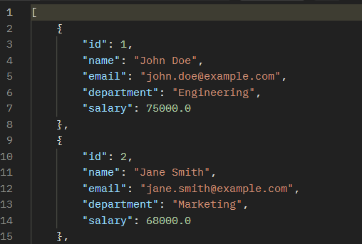
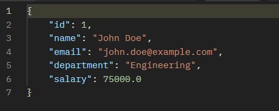
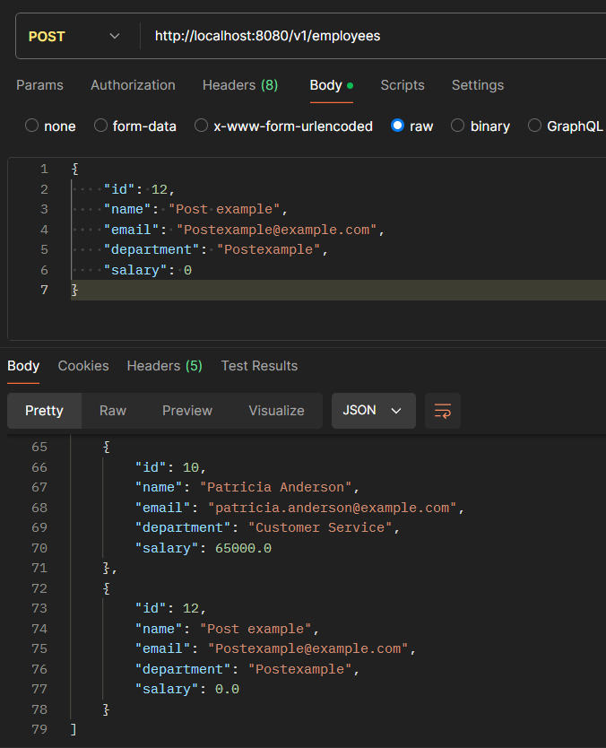
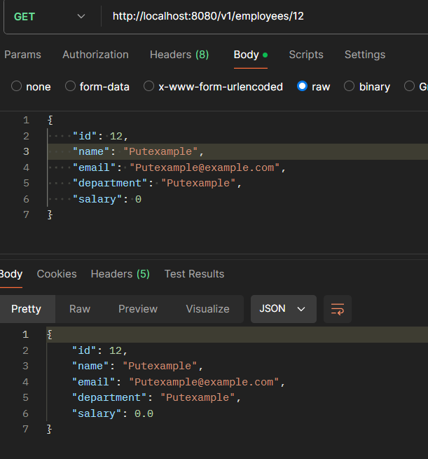
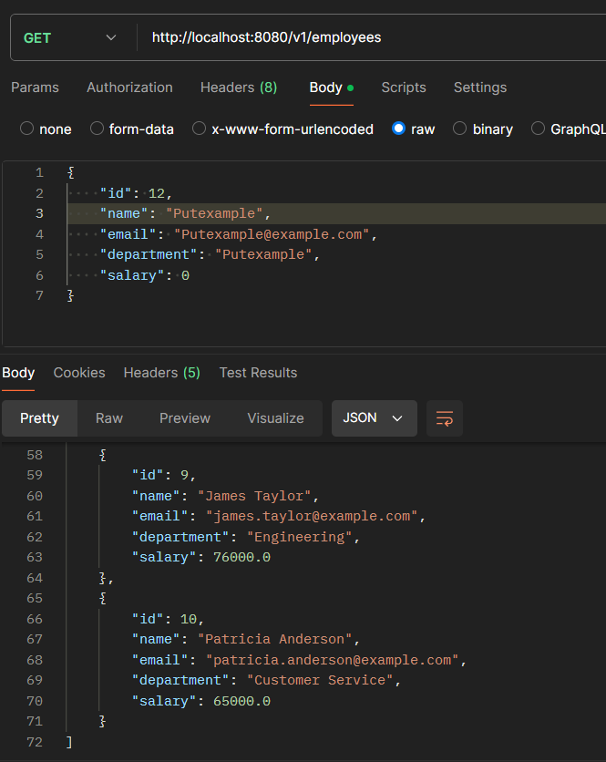

# Assignment 2: Employee Management System with JDBC Template

## Step 1: Set Up Your Spring Boot Project


   - Use Spring Initializr (https://start.spring.io/) to create a new Spring Boot project. (for this assignment we will name it as com.example.lecture8_assignment2)
   - Add dependencies:
     - `Spring Web`: To build web, including RESTful, applications using Spring MVC.
     - `Spring Data JPA`: To simplify database access and ORM management with JPA.
     - `Spring Boot DevTools`: To provide developer tools like automatic restart, live reload, etc.
     - `MySQL Driver`: To connect and interact with MySQL database.


## Step 2: Configure Database Connection

   - Open the `src/main/resources/application.properties` file and add the following properties:
   ```properties
   spring.datasource.url=jdbc:mysql://localhost:3306/employee_ass2
   spring.datasource.driverClassName=com.mysql.cj.jdbc.Driver
   spring.datasource.username=your_username
   spring.datasource.password=your_password
   spring.jpa.hibernate.ddl-auto=update
   spring.jpa.database-platform=org.hibernate.dialect.MySQLDialect
   ```
   - Replace `your_username` and `your_password` with your MySQL database credentials.
   - These properties configure Spring Boot to use a MySQL database located at `localhost` on port `3306` with a database named `employee_ass2`.

## Step 3: Create Employee Table

1. **Create a schema with mysql**

   - Create a schema as the database containing the employees data

   ```sql
   CREATE TABLE Employee (
       id INT AUTO_INCREMENT PRIMARY KEY,
       name VARCHAR(255) NOT NULL,
       email VARCHAR(255) NOT NULL,
       department VARCHAR(255) NOT NULL,
       salary DOUBLE NOT NULL
   );

   INSERT INTO Employee (name, email, department, salary) VALUES ('John Doe', 'john.doe@example.com', 'Engineering', 75000);
   INSERT INTO Employee (name, email, department, salary) VALUES ('Jane Smith', 'jane.smith@example.com', 'Marketing', 68000);
   INSERT INTO Employee (name, email, department, salary) VALUES ('Robert Johnson', 'robert.johnson@example.com', 'Sales', 72000);
   INSERT INTO Employee (name, email, department, salary) VALUES ('Emily Davis', 'emily.davis@example.com', 'HR', 64000);
   INSERT INTO Employee (name, email, department, salary) VALUES ('Michael Brown', 'michael.brown@example.com', 'Engineering', 80000);
   INSERT INTO Employee (name, email, department, salary) VALUES ('Linda Williams', 'linda.williams@example.com', 'Finance', 77000);
   INSERT INTO Employee (name, email, department, salary) VALUES ('David Miller', 'david.miller@example.com', 'IT', 69000);
   INSERT INTO Employee (name, email, department, salary) VALUES ('Susan Wilson', 'susan.wilson@example.com', 'Operations', 73000);
   INSERT INTO Employee (name, email, department, salary) VALUES ('James Taylor', 'james.taylor@example.com', 'Engineering', 76000);
   INSERT INTO Employee (name, email, department, salary) VALUES ('Patricia Anderson', 'patricia.anderson@example.com', 'Customer Service', 65000);
   ```

2. **Create a SQL Script to Initialize the Database**
   - Create a file named `data.sql` in the `src/main/resources` directory with the following content:
   ```sql
   CREATE TABLE Employee (
       id INT AUTO_INCREMENT PRIMARY KEY,
       name VARCHAR(255) NOT NULL,
       email VARCHAR(255) NOT NULL,
       department VARCHAR(255) NOT NULL,
       salary DOUBLE NOT NULL
   );
   ```
   - This SQL script creates an `Employee` table in your projects.

## Step 4: Create the Employee Model

**Create Employee Class**
   - Create a new Java class named `Employee` in the `model` package.
   ```java
package com.example.lecture8_assignment2.model;

public class Employee {
      private int id;
      private String name;
      private String email;
      private String department;
      private double salary;

      // Getters
      public int getId() {
         return id;
      }

      public String getName() {
         return name;
      }

      public String getEmail() {
         return email;
      }

      public String getDepartment() {
         return department;
      }

      public double getSalary() {
         return salary;
      }

      // Setters
      public void setId(int id) {
         this.id = id;
      }

      public void setName(String name) {
         this.name = name;
      }

      public void setEmail(String email) {
         this.email = email;
      }

      public void setDepartment(String department) {
         this.department = department;
      }

      public void setSalary(double salary) {
         this.salary = salary;
      }
}
```

   - This class should have fields for `id`, `name`, `email`, `department`, and `salary`.
   - Add getters and setters for each field to access and modify their values.

## Step 5: Create the Employee Repository

**Create EmployeeRepository Class**
   - Create a new Java class named `EmployeeRepository` in the `repository` package.
   ```java
   package com.example.lecture8_assignment2.repository;

import com.example.lecture8_assignment2.model.Employee;
import org.springframework.beans.factory.annotation.Autowired;
import org.springframework.jdbc.core.JdbcTemplate;
import org.springframework.jdbc.core.RowMapper;
import org.springframework.stereotype.Repository;

import java.sql.ResultSet;
import java.sql.SQLException;
import java.util.List;

@Repository
public class EmployeeRepository {

    @Autowired
    private JdbcTemplate jdbcTemplate;

    public List<Employee> findAll() {
        String sql = "SELECT * FROM Employee";
        return jdbcTemplate.query(sql, new EmployeeRowMapper());
    }

    public Employee findById(int id) {
        String sql = "SELECT * FROM Employee WHERE id = ?";
        return jdbcTemplate.queryForObject(sql, new Object[]{id}, new EmployeeRowMapper());
    }

    public int save(Employee employee) {
        String sql = "INSERT INTO Employee (name, email, department, salary) VALUES (?, ?, ?, ?)";
        return jdbcTemplate.update(sql, employee.getName(), employee.getEmail(), employee.getDepartment(), employee.getSalary());
    }

    public int update(Employee employee) {
        String sql = "UPDATE Employee SET name = ?, email = ?, department = ?, salary = ? WHERE id = ?";
        return jdbcTemplate.update(sql, employee.getName(), employee.getEmail(), employee.getDepartment(), employee.getSalary(), employee.getId());
    }

    public int deleteById(int id) {
        String sql = "DELETE FROM Employee WHERE id = ?";
        return jdbcTemplate.update(sql, id);
    }

    class EmployeeRowMapper implements RowMapper<Employee> {
        @Override
        public Employee mapRow(ResultSet rs, int rowNum) throws SQLException {
            Employee employee = new Employee();
            employee.setId(rs.getInt("id"));
            employee.setName(rs.getString("name"));
            employee.setEmail(rs.getString("email"));
            employee.setDepartment(rs.getString("department"));
            employee.setSalary(rs.getDouble("salary"));
            return employee;
        }
    }
}
```


   - This class will contain methods to interact with the database, such as finding, saving, updating, and deleting employees.
   - Use `JdbcTemplate` to execute SQL queries and map the results to the `Employee` model.

## Step 6: Create the Employee Service

**Create EmployeeService Class**
   - Create a new Java class named `EmployeeService` in the `service` package.
```java
package com.example.lecture8_assignment2.service;

import com.example.lecture8_assignment2.model.Employee;
import com.example.lecture8_assignment2.repository.EmployeeRepository;
import org.springframework.beans.factory.annotation.Autowired;
import org.springframework.stereotype.Service;

import java.util.List;

@Service
public class EmployeeService {

    @Autowired
    private EmployeeRepository employeeRepository;

    public List<Employee> getAllEmployees() {
        return employeeRepository.findAll();
    }

    public Employee getEmployeeById(int id) {
        return employeeRepository.findById(id);
    }

    public void saveEmployee(Employee employee) {
        employeeRepository.save(employee);
    }

    public void updateEmployee(Employee employee) {
        employeeRepository.update(employee);
    }

    public void deleteEmployee(int id) {
        employeeRepository.deleteById(id);
    }
}

```

   - This class will contain business logic for managing employees, such as retrieving all employees, finding an employee by ID, saving a new employee, updating an existing employee, and deleting an employee.

## Step 7: Create the Employee Controller

**Create EmployeeController Class**
```java
package com.example.lecture8_assignment2.controller;

import com.example.lecture8_assignment2.model.Employee;
import com.example.lecture8_assignment2.service.EmployeeService;
import org.springframework.beans.factory.annotation.Autowired;
import org.springframework.web.bind.annotation.*;

import java.util.List;

@RestController
@RequestMapping("/v1/employees")
public class EmployeeController {

    @Autowired
    private EmployeeService employeeService;

    @GetMapping
    public List<Employee> getAllEmployees() {
        return employeeService.getAllEmployees();
    }

    @GetMapping("/{id}")
    public Employee getEmployeeById(@PathVariable int id) {
        return employeeService.getEmployeeById(id);
    }

    @PostMapping
    public void createEmployee(@RequestBody Employee employee) {
        employeeService.saveEmployee(employee);
    }

    @PutMapping("/{id}")
    public void updateEmployee(@PathVariable int id, @RequestBody Employee employee) {
        employee.setId(id);
        employeeService.updateEmployee(employee);
    }

    @DeleteMapping("/{id}")
    public void deleteEmployee(@PathVariable int id) {
        employeeService.deleteEmployee(id);
    }
}

```
   - Create a new Java class named `EmployeeController` in the `controller` package.
   - This class will define RESTful endpoints to handle HTTP requests for managing employees.
   - Use `@RestController` and `@RequestMapping` annotations to define the controller and map HTTP requests to handler methods.

## Step 8: Run the Application

1. **Folder Structure**

   - Your completed project should have structure like this
```
src
└── main
    ├── java
    │   └── com
    │       └── example
    │           └── lecture8_assignment2
    │               ├── Lecture8Assignment2Application.java
    │               ├── controller
    │               │   └── EmployeeController.java
    │               ├── model
    │               │   └── Employee.java
    │               ├── repository
    │               │   └── EmployeeRepository.java
    │               └── service
    │                   └── EmployeeService.java
    └── resources
        ├── application.properties
```

2. **Run the Spring Boot Application**
   - Right-click on your main application class (the one annotated with `@SpringBootApplication`) and select "Java Run".
   - This will start the Spring Boot application and initialize the database with the `Employee` table and mock data.

3. **Test the CRUD Operations**
   - Use Postman or a similar tool to test the RESTful endpoints:
     - `GET /v1/employees`: Retrieve a list of all employees.
     
     - `GET /v1/employees/{id}`: Retrieve details of a specific employee by ID.
     
     - `POST /v1/employees/add`: Create a new employee.
      
     - `PUT /v1/employees/{id}`: Update an existing employee by ID.
     
     - `DELETE /v1/employees/{id}`: Delete an employee by ID.
     

