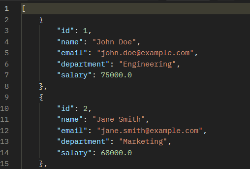
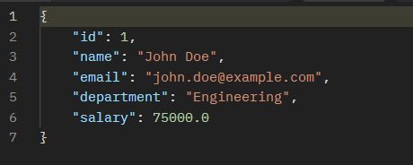
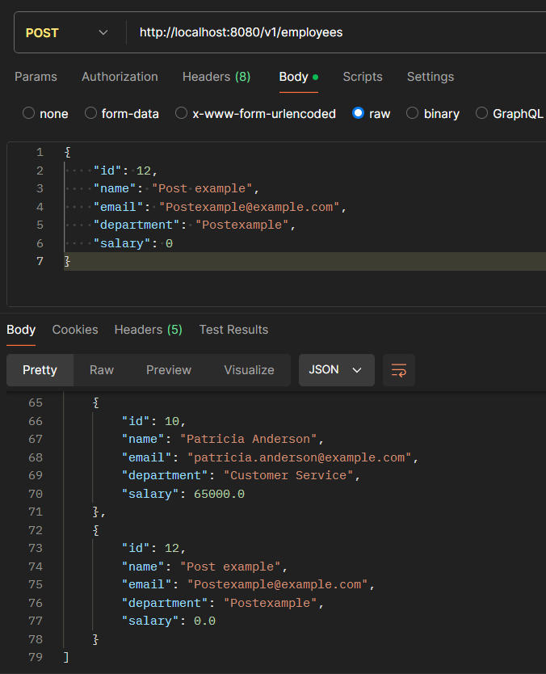
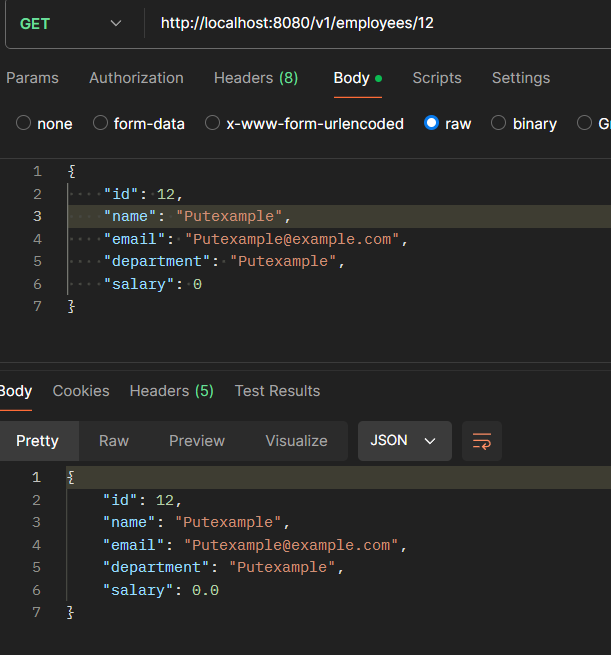
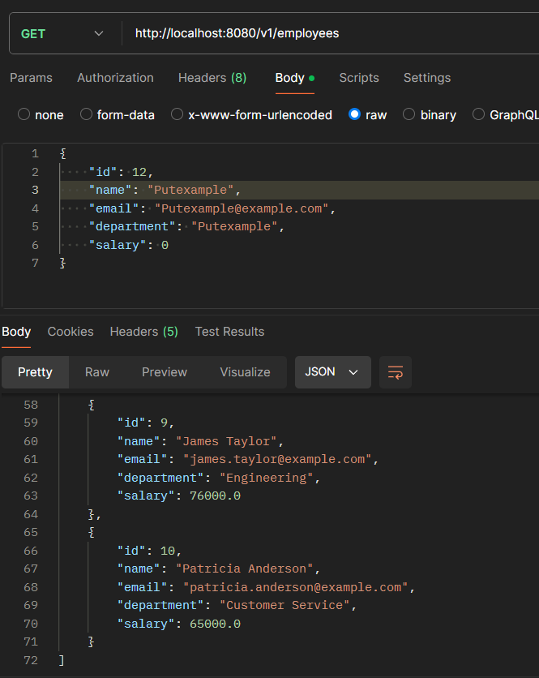

# Assignment 3: Advanced Employee Management System

## Number 1: Change Assignment 2 to Create DataSource Using Bean, Not Application Properties

1. **Remove DataSource Configuration from `application.properties`**
   - Remove the following properties from your `application.properties` file:
   ```properties
   spring.datasource.url=jdbc:mysql://localhost:3306/employee_ass2
   spring.datasource.driverClassName=com.mysql.cj.jdbc.Driver
   spring.datasource.username=your_username
   spring.datasource.password=your_password
   spring.jpa.hibernate.ddl-auto=update
   spring.jpa.database-platform=org.hibernate.dialect.MySQLDialect
   ```
   - These properties are used to configure the database connection directly from the `application.properties` file. We will move this configuration to a Java class.

2. **Create a DataSource Configuration Class**
   - Create a new Java class named `<DataSourceConfig>` in the `config` package. This class will define the DataSource bean that will be used to configure the database connection.
   ```java
   package com.example.lecture8_assignment3.config;

   import org.springframework.boot.context.properties.ConfigurationProperties;
   import org.springframework.context.annotation.Bean;
   import org.springframework.context.annotation.Configuration;
   import org.springframework.jdbc.datasource.DriverManagerDataSource;

   import javax.sql.DataSource;

   @Configuration
   public class DataSourceConfig {

       @Bean
       @ConfigurationProperties(prefix = "spring.datasource")
       public DataSource dataSource() {
           DriverManagerDataSource dataSource = new DriverManagerDataSource();
           dataSource.setDriverClassName("com.mysql.cj.jdbc.Driver");
           dataSource.setUrl("jdbc:mysql://localhost:3306/employee_ass2");
           dataSource.setUsername("your_username");
           dataSource.setPassword("your_password");
           return dataSource;
       }
   }
   ```
   - The `@Configuration` annotation indicates that the class has `@Bean` definition methods. Spring container can process the class to generate Spring Beans to be used in the application.
   - The `dataSource()` method is annotated with `@Bean`, which registers it as a bean in the Spring application context. This method creates and configures a `DriverManagerDataSource` object, setting the JDBC driver, URL, username, and password for connecting to the MySQL database.

3. **Add DataSource Configuration Properties to `application.properties`**
   - Add the following properties to `application.properties` to support the `ConfigurationProperties` annotation:
   ```properties
   spring.datasource.url=jdbc:mysql://localhost:3306/employee_ass2
   spring.datasource.driver-class-name=com.mysql.cj.jdbc.Driver
   spring.datasource.username=your_username
   spring.datasource.password=your_password
   ```
   - These properties will be used by the `@ConfigurationProperties` annotation in the `DataSourceConfig` class to configure the DataSource bean.

## Number 2: Handle Transactions When Insert/Update Data

1. **Enable Transaction Management**
   - Add the `@EnableTransactionManagement` annotation to your main application class:
   ```java
   package com.example.lecture8_assignment3.demo;

   import org.springframework.boot.SpringApplication;
   import org.springframework.boot.autoconfigure.SpringBootApplication;
   import org.springframework.transaction.annotation.EnableTransactionManagement;

   @SpringBootApplication
   @EnableTransactionManagement
   public class DemoApplication {

       public static void main(String[] args) {
           SpringApplication.run(DemoApplication.class, args);
       }
   }
   ```
   - The `@EnableTransactionManagement` annotation is used to enable Spring's annotation-driven transaction management capability. It allows the use of `@Transactional` annotations in the service layer to manage transactions.

2. **Add Transactional Support in Service Layer**
   - Add the `@Transactional` annotation to the methods in your `<EmployeeService>` class that modify data:
   ```java
   package com.example.lecture8_assignment3.service;

   import com.example.lecture8_assignment3.model.Employee;
   import com.example.lecture8_assignment3.repository.EmployeeRepository;
   import org.springframework.beans.factory.annotation.Autowired;
   import org.springframework.stereotype.Service;
   import org.springframework.transaction.annotation.Transactional;

   import java.util.List;

   @Service
   public class EmployeeService {

       @Autowired
       private EmployeeRepository employeeRepository;

       public List<Employee> getAllEmployees() {
           return employeeRepository.findAll();
       }

       public Employee getEmployeeById(int id) {
           return employeeRepository.findById(id);
       }

       @Transactional
       public void saveEmployee(Employee employee) {
           employeeRepository.save(employee);
       }

       @Transactional
       public void updateEmployee(Employee employee) {
           employeeRepository.update(employee);
       }

       @Transactional
       public void deleteEmployee(int id) {
           employeeRepository.deleteById(id);
       }
   }
   ```
   - The `@Transactional` annotation on the `saveEmployee`, `updateEmployee`, and `deleteEmployee` methods ensures that these operations are executed within a transaction. If any of these methods fail, the transaction will be rolled back, maintaining data integrity.

## Number 3: [Optional] Research Lombok and Add to Project

1. **Add Lombok Dependency to `pom.xml`**
   - Add the Lombok dependency to your `pom.xml` file:
   ```xml
   <dependency>
       <groupId>org.projectlombok</groupId>
       <artifactId>lombok</artifactId>
       <version>1.18.26</version>
       <scope>provided</scope>
   </dependency>
   ```
   - Lombok is a library that helps reduce boilerplate code in Java by providing annotations to generate getters, setters, constructors, etc.

2. **Update the Employee Model with Lombok Annotations**
   - Modify your `<Employee>` class to use Lombok annotations for getters, setters, and other boilerplate code:
   ```java
   package com.example.demo.model;

   import lombok.AllArgsConstructor;
   import lombok.Data;
   import lombok.NoArgsConstructor;

   @Data
   @NoArgsConstructor
   @AllArgsConstructor
   public class Employee {
       private int id;
       private String name;
       private String email;
       private String department;
       private double salary;
   }
   ```
   - The `@Data` annotation is a shortcut for `@ToString`, `@EqualsAndHashCode`, `@Getter`, `@Setter`, and `@RequiredArgsConstructor`.
   - The `@NoArgsConstructor` annotation generates a no-argument constructor.
   - The `@AllArgsConstructor` annotation generates a constructor with one parameter for each field in the class.

3. **Enable Annotation Processing in Your IDE**
   - Ensure that annotation processing is enabled in your IDE to use Lombok annotations effectively. This setting is typically found in the preferences or settings menu of your IDE.

## Run the Application

1. **Folder Structure**

   - Your completed project should have structure like this
```
src
└── main
    ├── java
    │   └── com
    │       └── example
    │           └── demo
    │               ├── Lecture8Assignmet3.java
    │               ├── config
    │               │   └── DataSourceConfig.java
    │               ├── controller
    │               │   └── EmployeeController.java
    │               ├── model
    │               │   └── Employee.java 
    │               ├── repository
    │               │   └── EmployeeRepository.java
    │               └── service
    │                   └── EmployeeService.java
    └── resources
        ├── application.properties
        └── data.sql 
```

1. **Run the Spring Boot Application**
   - Right-click on your main application class (the one annotated with `@SpringBootApplication`) and select "Run".

2. **Test the CRUD Operations**
   - Use Postman or a similar tool to test the RESTful endpoints:
     - `GET /v1/employees`: Retrieve a list of all employees.
     
     - `GET /v1/employees/{id}`: Retrieve details of a specific employee by ID.
     
     - `POST /v1/employees/add`: Create a new employee.
      
     - `PUT /v1/employees/{id}`: Update an existing employee by ID.
     
     - `DELETE /v1/employees/{id}`: Delete an employee by ID.
     
