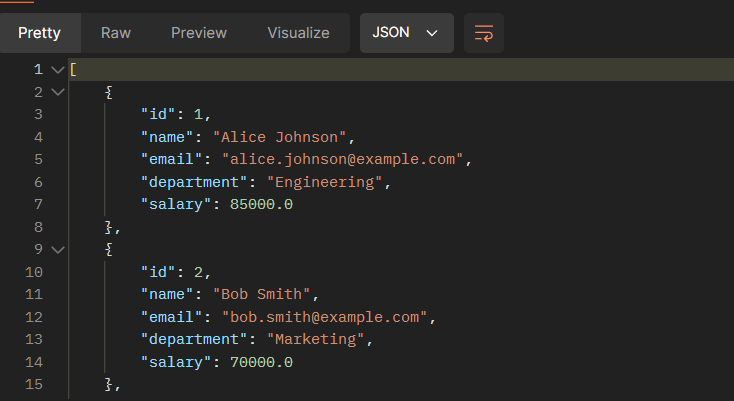
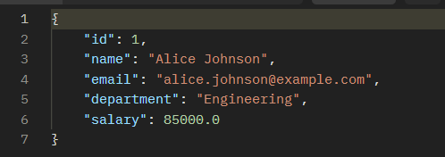
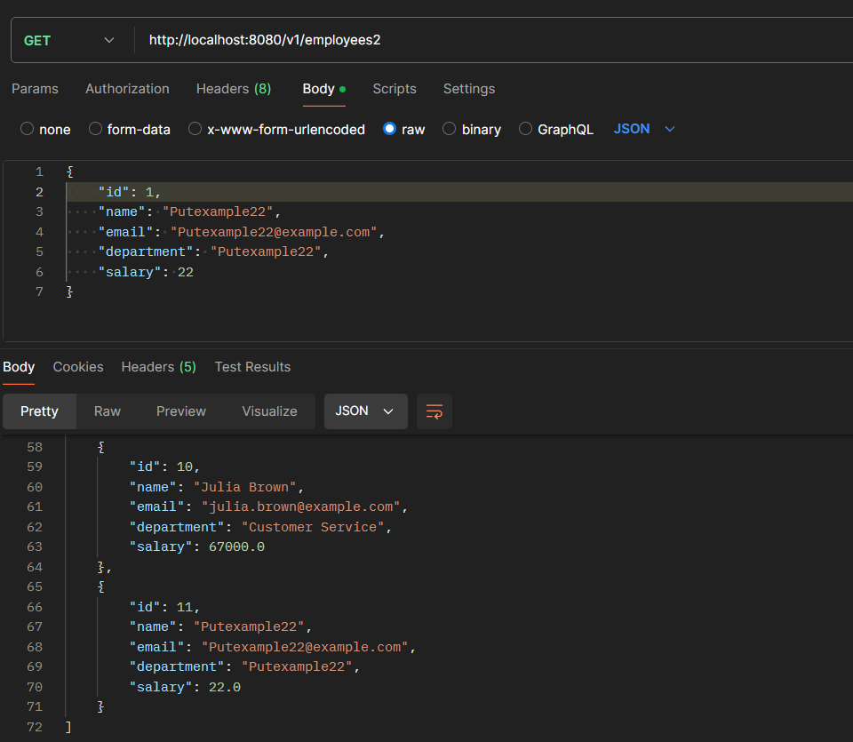
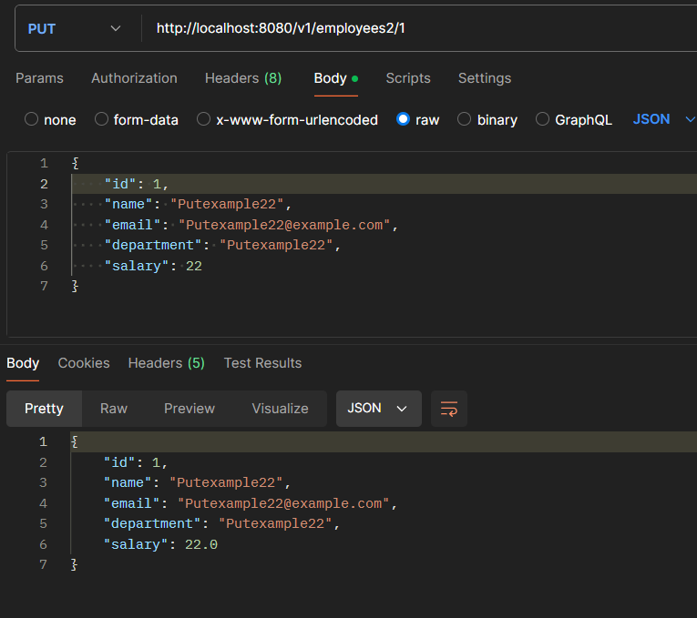
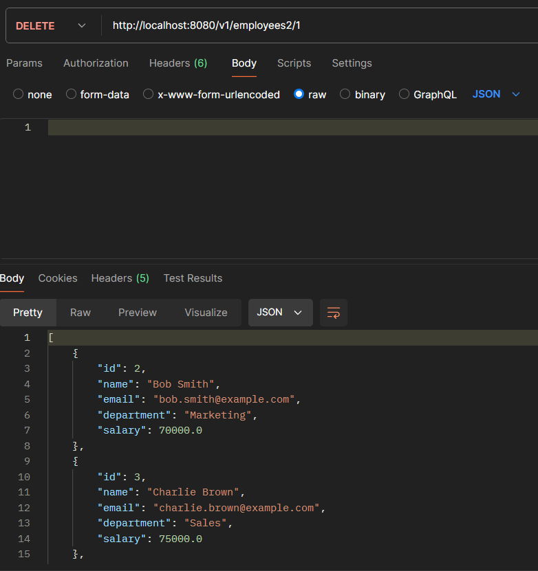

# Assignment 3 Solution

## 1. Change Assignment 2 to Create DataSource Using Bean, Not Application Properties

To manage multiple data sources in a Spring Boot application, we need to define each data source as a bean. This approach provides better flexibility and control over the data source configurations.

### **Changes:**
1. Create new schema for datasource
2. Change existing data source configurations from `application.properties`.
3. Create a `DataSourceConfig` class to define the data source beans and JDBC templates..
4. Make the repisitory, service and controller class for the second datasource.

### **Implementation:**
**1. Create new schema for datasource**

for this assignment we need a second datasource, you need to run this code below in mysql workbench for this project to work (you can change the mock data).

```sql
CREATE SCHEMA `employee_ass2_second` ;

use employee_ass2_second;

CREATE TABLE Employee (
    id INT AUTO_INCREMENT  PRIMARY KEY,
    name VARCHAR(255) NOT NULL,
    email VARCHAR(255) NOT NULL,
    department VARCHAR(255) NOT NULL,
    salary DOUBLE NOT NULL
);

INSERT INTO Employee (name, email, department, salary) VALUES ('Alice Johnson', 'alice.johnson@example.com', 'Engineering', 85000);
INSERT INTO Employee (name, email, department, salary) VALUES ('Bob Smith', 'bob.smith@example.com', 'Marketing', 70000);
INSERT INTO Employee (name, email, department, salary) VALUES ('Charlie Brown', 'charlie.brown@example.com', 'Sales', 75000);
INSERT INTO Employee (name, email, department, salary) VALUES ('Diana Prince', 'diana.prince@example.com', 'HR', 68000);
INSERT INTO Employee (name, email, department, salary) VALUES ('Edward Green', 'edward.green@example.com', 'Engineering', 82000);
INSERT INTO Employee (name, email, department, salary) VALUES ('Fiona White', 'fiona.white@example.com', 'Finance', 78000);
INSERT INTO Employee (name, email, department, salary) VALUES ('George Black', 'george.black@example.com', 'IT', 71000);
INSERT INTO Employee (name, email, department, salary) VALUES ('Hannah Gray', 'hannah.gray@example.com', 'Operations', 74000);
INSERT INTO Employee (name, email, department, salary) VALUES ('Ian Blue', 'ian.blue@example.com', 'Engineering', 79000);
INSERT INTO Employee (name, email, department, salary) VALUES ('Julia Brown', 'julia.brown@example.com', 'Customer Service', 67000);
```

**2. Change data source configuration from `application.properties`.**
   
   change the data source configuration properties to the `application.properties` file. These properties provide the necessary configuration details for the data source beans defined in the configuration class.


```
spring.application.name=lecture8_assignment3

spring.datasource1.url=jdbc:mysql://localhost:3306/employee_ass2
spring.datasource1.driver-class-name=com.mysql.cj.jdbc.Driver
spring.datasource1.username=<your_username>
spring.datasource1.password=<your_password>

spring.datasource2.url=jdbc:mysql://localhost:3306/employee_ass2_second
spring.datasource2.driver-class-name=com.mysql.cj.jdbc.Driver
spring.datasource2.username=<your_username>
spring.datasource2.password=<your_password>

```
**3. Create a `DataSourceConfig` class to define the data source beans and JDBC templates.**

   Define a configuration class that creates and configures two data source beans, `datasource1` and `datasource2`, and their corresponding `JdbcTemplate` beans. This approach allows us to manage multiple data sources within the application context.


```java
package com.example.lecture8_assignment3.config;

import org.springframework.beans.factory.annotation.Qualifier;
import org.springframework.boot.context.properties.ConfigurationProperties;
import org.springframework.context.annotation.Bean;
import org.springframework.context.annotation.Configuration;
import org.springframework.jdbc.core.JdbcTemplate;
import org.springframework.jdbc.datasource.DriverManagerDataSource;
import javax.sql.DataSource;

@Configuration
public class DataSourceConfig {

    @Bean(name = "datasource1")
    @ConfigurationProperties(prefix = "spring.datasource1")
    public DataSource dataSource1() {
        DriverManagerDataSource dataSource = new DriverManagerDataSource();
        dataSource.setDriverClassName("com.mysql.cj.jdbc.Driver");
        dataSource.setUrl("jdbc:mysql://localhost:3306/employee_ass2");
        dataSource.setUsername("root");
        dataSource.setPassword("dayak1352");
        return dataSource;
    }

    @Bean(name = "datasource2")
    @ConfigurationProperties(prefix = "spring.datasource2")
    public DataSource dataSource2() {
        DriverManagerDataSource dataSource = new DriverManagerDataSource();
        dataSource.setDriverClassName("com.mysql.cj.jdbc.Driver");
        dataSource.setUrl("jdbc:mysql://localhost:3306/employee_ass2_second");
        dataSource.setUsername("root");
        dataSource.setPassword("dayak1352");
        return dataSource;
    }

    @Bean(name = "jdbcTemplate1")
    public JdbcTemplate jdbcTemplate1(@Qualifier("datasource1") DataSource ds) {
        return new JdbcTemplate(ds);
    }

    @Bean(name = "jdbcTemplate2")
    public JdbcTemplate jdbcTemplate2(@Qualifier("datasource2") DataSource ds) {
        return new JdbcTemplate(ds);
    }
}

```

   - `@Configuration`: This annotation indicates that the class contains bean definitions for the Spring application context.
   - `@Bean`: This annotation indicates that a method produces a bean to be managed by the Spring container.
   - `DriverManagerDataSource`: A simple implementation of `javax.sql.DataSource` that is configured via JavaBeans properties.
   - `@Qualifier`: This annotation is used to specify which bean should be injected when there are multiple beans of the same type.

**4. Make the repisitory, service and controller class for the second datasource.**

- Repisitory
- Service
- Controller

## 2. Handle Transaction When Insert/Update Data

To ensure data integrity and consistency, we need to handle transactions when performing insert or update operations. This ensures that operations are atomic, consistent, isolated, and durable (**ACID**).

A transaction in the context of a database is a sequence of operations performed as a single logical unit of work. A transaction has four key properties, commonly known as the **ACID** properties:

1. **Atomicity**:
   - Ensures that all operations within a transaction are completed successfully; otherwise, the transaction is aborted at the point of failure, and all previous operations are rolled back to their initial state. This guarantees that partial transactions do not occur.

2. **Consistency**:
   - Ensures that a transaction brings the database from one valid state to another, maintaining database invariants. This means that the database remains consistent before and after the transaction.

3. **Isolation**:
   - Ensures that the operations in a transaction are isolated from other transactions. Changes made by a transaction are not visible to other transactions until the transaction is committed. This prevents concurrent transactions from interfering with each other.

4. **Durability**:
   - Ensures that once a transaction has been committed, it will remain committed even in the case of a system failure. This is achieved by saving all changes made by the transaction to a non-volatile memory.

### **Why Use Transactions?**
- **Data Integrity**: Transactions ensure that all operations within a transaction are completed successfully or none at all, thus maintaining data integrity.
- **Concurrency Control**: Transactions help manage concurrent access to the database, ensuring that simultaneous transactions do not interfere with each other.
- **Error Recovery**: Transactions provide a mechanism for recovering from errors. If an error occurs during a transaction, the system can roll back the transaction, undoing any changes made.
- **Consistency**: By maintaining the ACID properties, transactions ensure that the database remains in a consistent state.

### **Implementation:**
**1. Enable transaction management in the main application class.**

In the main application class, enable transaction management by using the `@EnableTransactionManagement` annotation. This annotation ensures that Spring's annotation-driven transaction management is enabled, allowing us to use the `@Transactional` annotation in our service methods.
```java
package com.example.lecture8_assignment3;

import org.springframework.boot.SpringApplication;
import org.springframework.boot.autoconfigure.SpringBootApplication;
import org.springframework.boot.autoconfigure.orm.jpa.HibernateJpaAutoConfiguration;
import org.springframework.transaction.annotation.EnableTransactionManagement;

@SpringBootApplication(exclude = HibernateJpaAutoConfiguration.class)
@EnableTransactionManagement
public class Lecture8Assignment3Application {

    public static void main(String[] args) {
        SpringApplication.run(Lecture8Assignment3Application.class, args);
    }
}

```

2. **Add transactional support in the service layer by annotating methods that modify data with `@Transactional`.**

   In the service class, annotate methods that modify data with the `@Transactional` annotation. This ensures that these methods are executed within a transactional context. If any exception occurs during the execution of these methods, the transaction will be rolled back, and no partial changes will be committed to the database.


```java
package com.example.lecture8_assignment3.service;

import com.example.lecture8_assignment3.model.Employee;
import com.example.lecture8_assignment3.repository.EmployeeRepository;
import com.example.lecture8_assignment3.repository.EmployeeRepository2;
import org.springframework.beans.factory.annotation.Autowired;
import org.springframework.stereotype.Service;
import org.springframework.transaction.annotation.Transactional;

import java.util.List;

@Service
public class EmployeeService {

    @Autowired
    private EmployeeRepository employeeRepository;

    @Autowired
    private EmployeeRepository2 employeeRepository2;

    public List<Employee> getAllEmployees() {
        return employeeRepository.findAll();
    }

    public Employee getEmployeeById(int id) {
        return employeeRepository.findById(id);
    }

    @Transactional
    public void saveEmployee(Employee employee) {
        employeeRepository.save(employee);
    }

    @Transactional
    public void updateEmployee(Employee employee) {
        employeeRepository.update(employee);
    }

    @Transactional
    public void deleteEmployee(int id) {
        employeeRepository.deleteById(id);
    }

    public List<Employee> getAllEmployees2() {
        return employeeRepository2.findAll();
    }

    public Employee getEmployeeById2(int id) {
        return employeeRepository2.findById(id);
    }

    @Transactional
    public void saveEmployee2(Employee employee) {
        employeeRepository2.save(employee);
    }

    @Transactional
    public void updateEmployee2(Employee employee) {
        employeeRepository2.update(employee);
    }

    @Transactional
    public void deleteEmployee2(int id) {
        employeeRepository2.deleteById(id);
    }
}

```

   - `@Transactional`: This annotation is used on methods (or classes) to specify that the method should be executed within a transactional context. If any exception occurs, the transaction is rolled back, ensuring data integrity and consistency.


## 3. [Optional] Research Lombok and Add to Project

**Introduction:**
Lombok is a Java library that helps to reduce boilerplate code, such as getters, setters, constructors, and more, by using annotations.

### **Why Use Lombok?**
- **Reduces Boilerplate Code**: Lombok generates common methods like getters, setters, `toString()`, `equals()`, and constructors, reducing the amount of boilerplate code you have to write.
- **Improves Code Readability**: With Lombok, the code becomes cleaner and more readable as the focus shifts to the business logic rather than boilerplate code.
- **Consistency**: Lombok ensures that the generated methods are consistent across the application.

### **Implementation:**
**1. Add Lombok dependency to the `pom.xml`.**
   Add the Lombok dependency to the `pom.xml` file. This includes the Lombok library in the project, allowing you to use its annotations.

```java
<dependency>
    <groupId>org.projectlombok</groupId>
    <artifactId>lombok</artifactId>
    <version>1.18.26</version>
    <scope>provided</scope>
</dependency>

```


**2. Update the `Employee` class to use Lombok annotations.**
   Modify the `Employee` class to use Lombok annotations. The `@Data` annotation generates all the boilerplate code required for a typical Java bean, such as getters, setters, `toString()`, `equals()`, and `hashCode` methods. The `@NoArgsConstructor` and `@AllArgsConstructor` annotations generate a no-argument constructor and an all-argument constructor, respectively.

```java
package com.example.lecture8_assignment3.model;

import lombok.AllArgsConstructor;
import lombok.Data;
import lombok.NoArgsConstructor;

@Data
@NoArgsConstructor
@AllArgsConstructor
public class Employee {
    private int id;
    private String name;
    private String email;
    private String department;
    private double salary;
}

```

   - `@Data`: A shortcut for `@ToString`, `@EqualsAndHashCode`, `@Getter` on all fields, `@Setter` on all non-final fields, and `@RequiredArgsConstructor`.
   - `@NoArgsConstructor`: Generates a no-argument constructor.
   - `@AllArgsConstructor`: Generates a constructor with one parameter for each field in the class.


## Run the Application

### **Folder Structure**

   - Your completed project should have structure like this
```
/src
├── main
  ├── java
  │ └── com
  │ └── example
  │ └── lecture8_assignment3
  │ ├── config
  │ │ └── DataSourceConfig.java
  │ ├── controller
  │ │ ├── EmployeeController.java
  │ │ └── EmployeeController2.java
  │ ├── model
  │ │ └── Employee.java
  │ ├── repository
  │ │ ├── EmployeeRepository.java
  │ │ └── EmployeeRepository2.java
  │ ├── service
  │ │ ├── EmployeeService.java
  │ │ └── EmployeeService2.java
  │ └── Lecture8Assignment3Application.java
  └── resources
    ├── application.properties
    └── data.sql
```

### **Test the CRUD Operations**
   - Use Postman or a similar tool to test the endpoints:
     - For DataSource 1:
       - `GET /v1/employees`:
     
     - `GET /v1/employees/{id}`:
     
     - `POST /v1/employees/add`:
      
     - `PUT /v1/employees/{id}`: by ID.
     
     - `DELETE /v1/employees/{id}`:
     
     - For DataSource 2:
       - `GET /v1/employees2`

       

       
       - `GET /v1/employees2/{id}`

       
       - `POST /v1/employees2`        

       
       - `PUT /v1/employees2/{id}`      

       
       - `DELETE /v1/employees2/{id}`       

       
