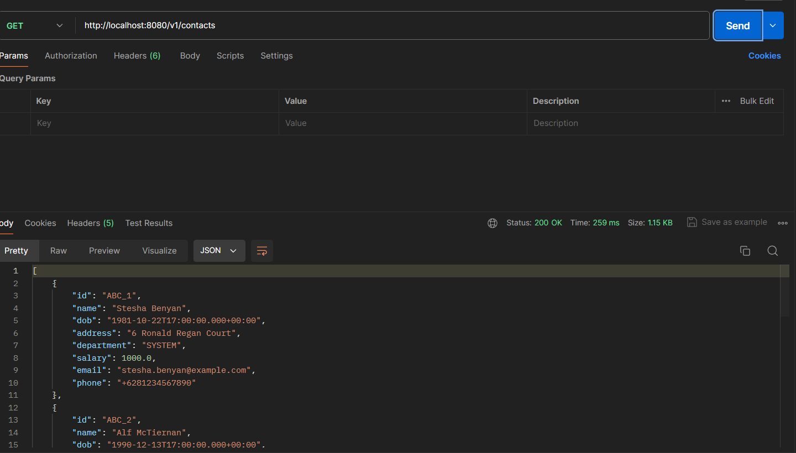
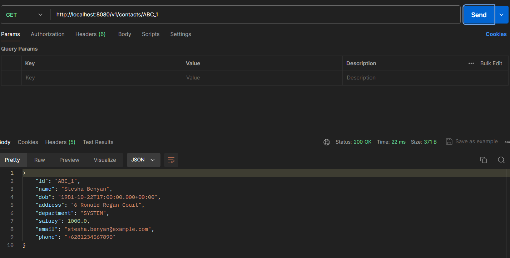
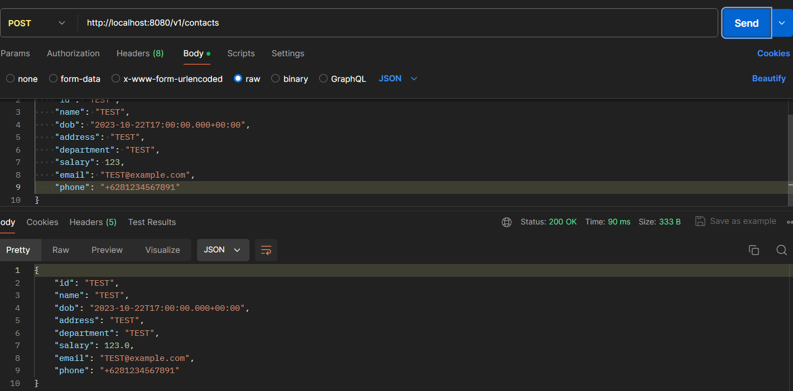
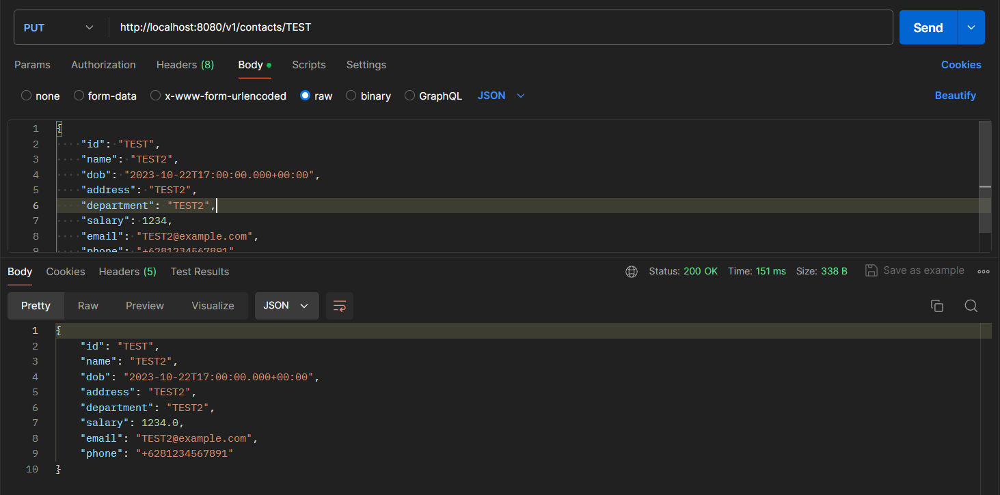
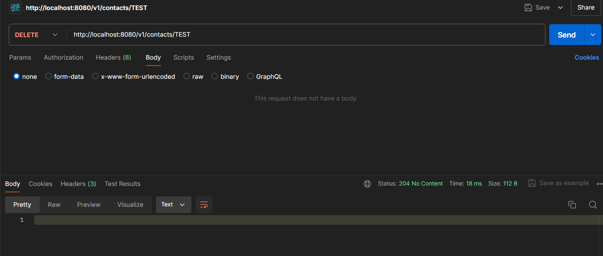
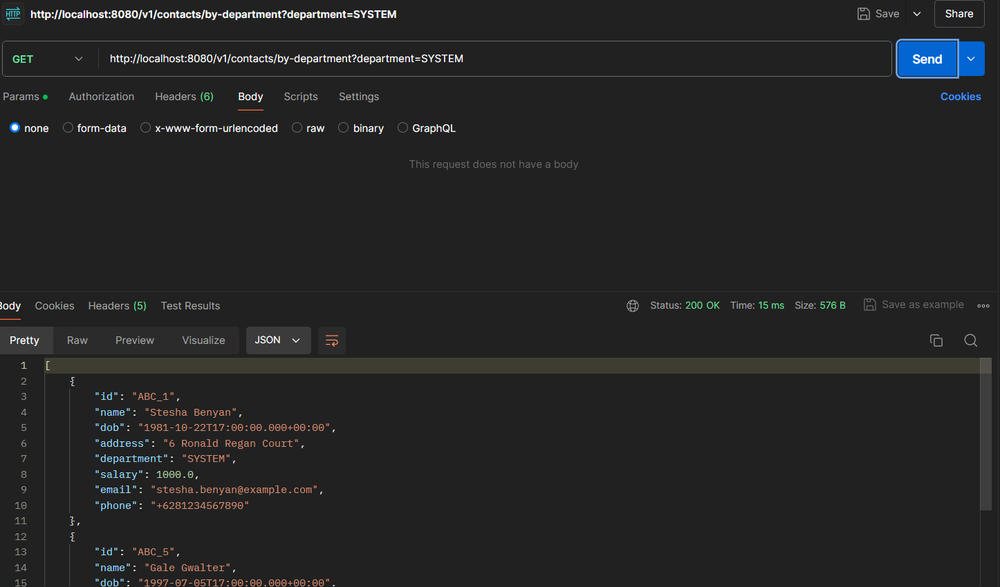

# Assignment 1 - Crud Employee management

This project is an updated project from lecture5 - assignment2, we will implement UUID, DTO and MapStruct

## 1. Use ID by UUID

UUID (Universally Unique Identifier) is used as the primary key for the `Contact` entity to ensure a unique identifier across different systems and databases.

**Implementation:**
- The `id` field in the `Contact` class is defined as a `String` to hold the UUID.
- A UUID is generated and set as the `id` during the creation of a new `Contact`.

### Contact
```java
package com.example.demo.model;

import jakarta.persistence.Entity;
import jakarta.persistence.Id;
import jakarta.validation.constraints.Email;
import jakarta.validation.constraints.NotNull;
import jakarta.validation.constraints.Pattern;
import jakarta.validation.constraints.Size;
import java.util.Date;

@Entity
public class Contact {

    @Id
    private String id;

    @NotNull
    @Size(min = 1, message = "Name should not be null")
    private String name;

    @NotNull
    private Date dob;

    @NotNull
    @Size(min = 1, message = "Address should not be null")
    private String address;

    @NotNull
    @Size(min = 1, message = "Department should not be null")
    private String department;

    @NotNull
    private Double salary;

    @Email(message = "Email should be valid")
    private String email;

    @Pattern(regexp = "^\\+62[0-9]{10,}$", message = "Phone number should follow Indonesian format")
    private String phone;

    public Contact() {
    }

    // constructor, getter and setter

```

**Explanation**
- `@Entity`: Marks this class as a JPA entity.
- `@Id`: Specifies the primary key field.
- `@NotNull`: Ensures that the field is not null.
- `@Size`: Ensures that the field meets size constraints.
- `@Email`: Ensures that the field contains a valid email address.
-` @Pattern`: Ensures that the field matches the specified regex pattern.

## 2. Use DTO and MapStruct

DTO (Data Transfer Object) is used to encapsulate data and transfer it between layers. MapStruct is a code generator that greatly simplifies the implementation of mappings between Java bean types.

**Implementation:**
- Created a `ContactDTO` class to represent the data transferred.
- Created a `ContactMapper` interface to handle the conversion between `Contact` and `ContactDTO`.

### ContactDTO
```java
package com.example.demo.dto;

import java.util.Date;

public class ContactDTO {

    private String id;
    private String name;
    private Date dob;
    private String address;
    private String department;
    private Double salary;
    private String email;
    private String phone;

    public ContactDTO() {
    }

    // constructor, getter, setter
}
```
- The `ContactDTO` class is used to encapsulate data for transferring between layers.
- It contains fields for `id`, `name`, `dob`, `address`, `department`, `salary`, `email`, and `phone`.
- The class includes a default constructor and a parameterized constructor.
- Getter and setter methods are provided for all fields.


### ContactMapper
```java
package com.example.demo.mapper;

import org.mapstruct.Mapper;
import org.mapstruct.factory.Mappers;

import com.example.demo.dto.ContactDTO;
import com.example.demo.model.Contact;

@Mapper
public interface ContactMapper {

    ContactMapper INSTANCE = Mappers.getMapper(ContactMapper.class);

    ContactDTO contactToContactDTO(Contact contact);
    Contact contactDTOToContact(ContactDTO contactDTO);
}

```

- @Mapper: Marks this interface as a MapStruct mapper.
- Mappers.getMapper(ContactMapper.class): Creates an instance of the mapper.

## 3. Handle Exception

Exception handling ensures the application can manage and respond to different errors gracefully, providing meaningful messages to the user.

**Implementation:**
- Defined a global exception handler using `@ControllerAdvice`.
- Handled specific exceptions and provided custom responses.

### GlobalExceptionHandler
```java
package com.example.demo.exception;

import java.util.HashMap;
import java.util.Map;

import org.springframework.http.HttpStatus;
import org.springframework.http.ResponseEntity;
import org.springframework.web.bind.MethodArgumentNotValidException;
import org.springframework.web.bind.annotation.ControllerAdvice;
import org.springframework.web.bind.annotation.ExceptionHandler;
import org.springframework.web.bind.annotation.ResponseStatus;

@ControllerAdvice
public class GlobalExceptionHandler {

    @ExceptionHandler(MethodArgumentNotValidException.class)
    @ResponseStatus(HttpStatus.BAD_REQUEST)
    public ResponseEntity<Object> handleValidationExceptions(MethodArgumentNotValidException ex) {
        Map<String, String> errors = new HashMap<>();
        ex.getBindingResult().getFieldErrors().forEach(error -> 
            errors.put(error.getField(), error.getDefaultMessage()));
        return new ResponseEntity<>(errors, HttpStatus.BAD_REQUEST);
    }
}
```

- `@ControllerAdvice`: Indicates that this class provides global exception handling across all controllers.
- `@ExceptionHandler`: Specifies the exception to handle.
- ResponseEntity: Represents the HTTP response, including the status code and body.
- `HttpStatus.INTERNAL_SERVER_ERROR`: Indicates that the server encountered an unexpected condition.
- `WebRequest`: Provides request information for the current HTTP request.


## 4. Validate Email, Name, and Phone

**Explanation:**
Validation ensures that the data entered by users meets certain criteria before processing.

**Implementation:**
- Used Hibernate Validator annotations to validate the fields in the `Contact` class.
- `@NotNull` and `@Size` annotations are used for the `name` field to ensure it is not null and has a minimum size.
- `@Email` annotation is used for the `email` field to ensure it is a valid email format.
- `@Pattern` annotation is used for the `phone` field to ensure it follows the Indonesian phone number format.

### Contact
```java
package com.example.demo.model;

import jakarta.persistence.Entity;
import jakarta.persistence.Id;
import jakarta.validation.constraints.Email;
import jakarta.validation.constraints.NotNull;
import jakarta.validation.constraints.Pattern;
import jakarta.validation.constraints.Size;
import java.util.Date;

@Entity
public class Contact {

    @Id
    private String id;

    @NotNull
    @Size(min = 1, message = "Name should not be null")
    private String name;

    @NotNull
    private Date dob;

    @NotNull
    @Size(min = 1, message = "Address should not be null")
    private String address;

    @NotNull
    @Size(min = 1, message = "Department should not be null")
    private String department;

    @NotNull
    private Double salary;

    @Email(message = "Email should be valid")
    private String email;

    @Pattern(regexp = "^\\+62[0-9]{10,}$", message = "Phone number should follow Indonesian format")
    private String phone;

    public Contact() {
    }

    // constructor, getter and setter

```


## Running the Project

### Step 1: Ensure MySQL Database is Running

Create the necessary database and table using the following SQL commands:

```sql
CREATE TABLE contact (
    id VARCHAR(36) NOT NULL,
    name VARCHAR(255) NOT NULL,
    dob DATE NOT NULL,
    address VARCHAR(255) NOT NULL,
    department VARCHAR(255) NOT NULL,
    salary DOUBLE NOT NULL,
    email VARCHAR(255),
    phone VARCHAR(20),
    PRIMARY KEY (id)
);

INSERT INTO contact (id, name, dob, address, department, salary, email, phone) VALUES
('ABC_1', 'Stesha Benyan', '1981-10-23', '6 Ronald Regan Court', 'SYSTEM', 1000.00, 'stesha.benyan@example.com', '+6281234567890'),
('ABC_2', 'Alf McTiernan', '1990-12-14', '9390 Utah Way', 'WEB', 2000.00, 'alf.mctiernan@example.com', '+6281234567891'),
('ABC_3', 'Olympe Nevill', '1985-05-30', '5 Rowland Pass', 'WEB', 1200.00, 'olympe.nevill@example.com', '+6281234567892'),
('ABC_4', 'Noemi Silwood', '1999-02-09', '92736 Orin Plaza', 'MOBILE', 1500.00, 'noemi.silwood@example.com', '+6281234567893'),
('ABC_5', 'Gale Gwalter', '1997-07-06', '5677 Express Lane', 'SYSTEM', 1700.00, 'gale.gwalter@example.com', '+6281234567894');


```

### Step 2: Build the Project
Clean and build the project using Maven:

```mvn clean install```

### Step 3: Run the Application
Run your Spring Boot application:

```mvn spring-boot:run```

### Step 3: Test the Endpoints
Use Postman or another tool to test the REST endpoints:


- **Get All Contacts**: `GET http://localhost:8080/v1/contacts`

- **Get Contact by ID**: `GET http://localhost:8080/v1/contacts/{id}`

- **Create Contact**: `POST http://localhost:8080/v1/contacts`

- **Update Contact**: `PUT http://localhost:8080/v1/contacts/{id}`

- **Delete Contact**: `DELETE http://localhost:8080/v1/contacts/{id}`
- **Import Contacts from File**: `POST http://localhost:8080/v1/contacts/import`

- **Get Contacts by Department**: `GET http://localhost:8080/v1/contacts/by-department?department={department}`

