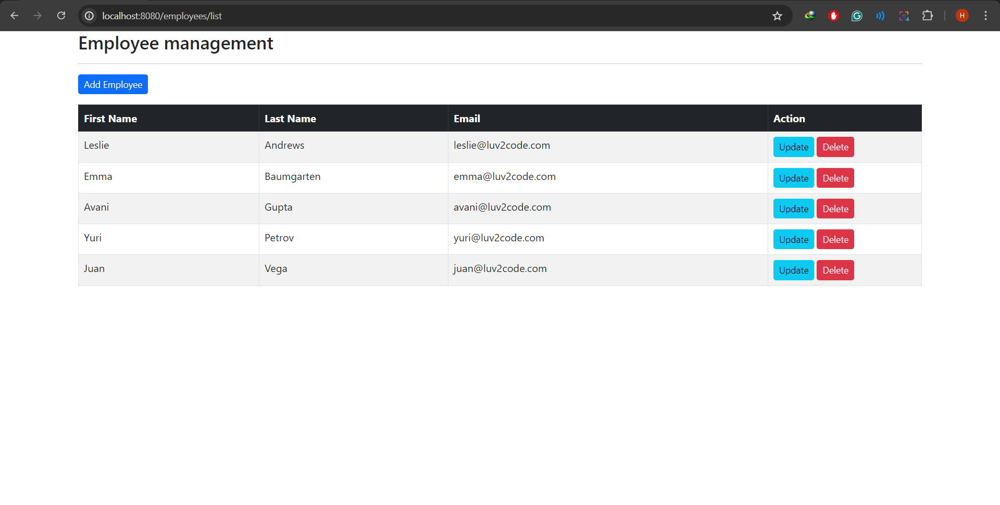
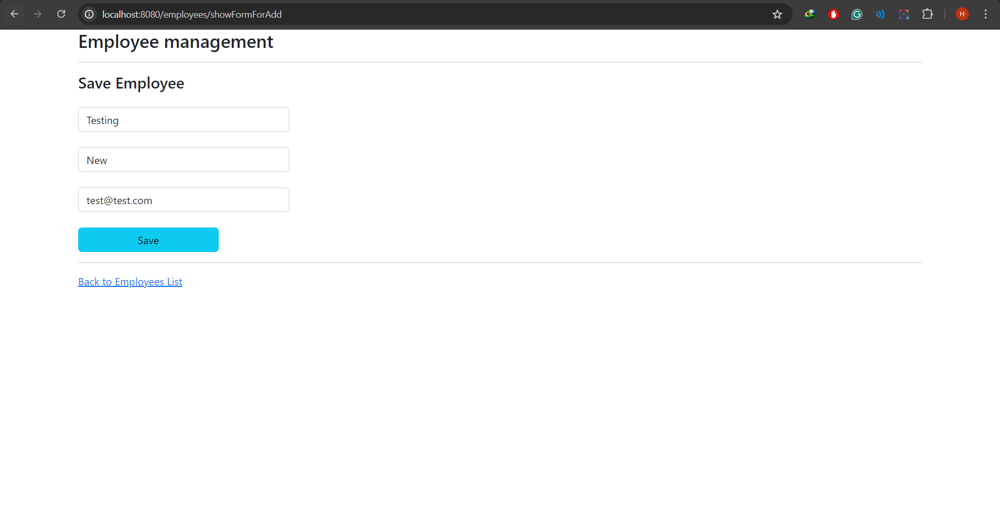
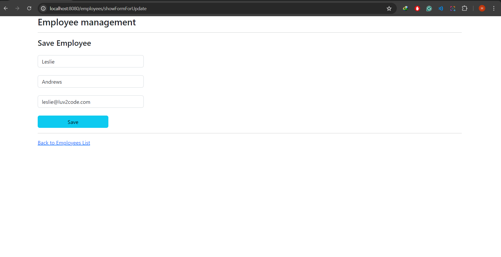
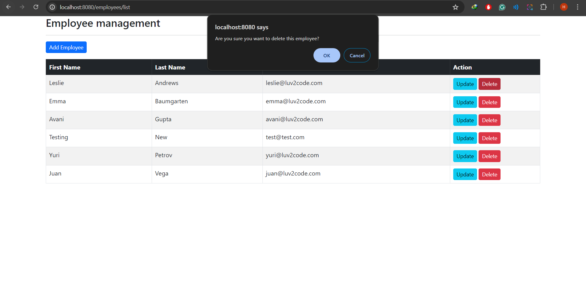

# Assignment 1: Spring MVN Project

## Depedencies

```java
<dependencies>
        <dependency>
            <groupId>org.springframework.boot</groupId>
            <artifactId>spring-boot-starter-data-jpa</artifactId>
        </dependency>
        <dependency>
            <groupId>com.mysql</groupId>
            <artifactId>mysql-connector-j</artifactId>
        </dependency>
        <dependency>
            <groupId>org.springframework.boot</groupId>
            <artifactId>spring-boot-starter-thymeleaf</artifactId>
        </dependency>
        <dependency>
            <groupId>org.springframework.boot</groupId>
            <artifactId>spring-boot-starter-web</artifactId>
        </dependency>

        <dependency>
            <groupId>org.projectlombok</groupId>
            <artifactId>lombok</artifactId>
            <optional>true</optional>
        </dependency>
        <dependency>
            <groupId>org.springframework.boot</groupId>
            <artifactId>spring-boot-starter-test</artifactId>
            <scope>test</scope>
        </dependency>
    </dependencies>
```

or see pom.xml in project

## Init Database

```sql
DROP TABLE IF EXISTS `employee`;

CREATE TABLE `employee` (
                            `id` int NOT NULL AUTO_INCREMENT,
                            `first_name` varchar(45) DEFAULT NULL,
                            `last_name` varchar(45) DEFAULT NULL,
                            `email` varchar(45) DEFAULT NULL,
                            PRIMARY KEY (`id`)
) ENGINE=InnoDB AUTO_INCREMENT=1 DEFAULT CHARSET=latin1;

--
-- Data for table `employee`
--

INSERT INTO `employee` VALUES
                           (1,'Leslie','Andrews','leslie@luv2code.com'),
                           (2,'Emma','Baumgarten','emma@luv2code.com'),
                           (3,'Avani','Gupta','avani@luv2code.com'),
                           (4,'Yuri','Petrov','yuri@luv2code.com'),
                           (5,'Juan','Vega','juan@luv2code.com');
```

## Configure properties

```java
spring.datasource.driver-class-name=com.mysql.jdbc.Driver
spring.datasource.url=jdbc:mysql://localhost:3306/<your_database>
spring.datasource.username=<your_user_name>
spring.datasource.password=<your_password>
```

## Folder Structure

```
assignment1
├── .mvn/wrapper/
│   └── maven-wrapper.properties
├── src/main/
│   ├── java/lecture9/assignment1/
│   │   ├── controller/
│   │   │   └── EmployeeController.java
│   │   ├── model/
│   │   │   └── Employee.java
│   │   ├── repository/
│   │   │   └── EmployeeRepository.java
│   │   ├── service/
│   │   │   ├── impl/
│   │   │   │   └─ EmployeeServiceImpl.java
│   │   │   └── EmployeeService.java
│   │   └── Assignment1Application.java
│   └── resources/
│       ├── static/
│       │   └── index.html
│       ├── templates/employees/
│       │   ├── employee-form.html
│       │   └── list-employees.html
│       └── application.properties
├── .gitignore
├── mvnw
├── mvnw.cmd
├── pom.xml
├── run.bat
└── run.sh
```

## Run Application

To run the application you can use terminal and run these commands:

Run mvn clean install to build the application.


```
$ mvn clean install
```
Run the Spring Boot application.

```
$ mvn spring-boot:run
```
Open localhost:8080 to see the application.

## Screenshot

### View All Employees



### Add New Employees



### Update Employees



### Delete Employees


