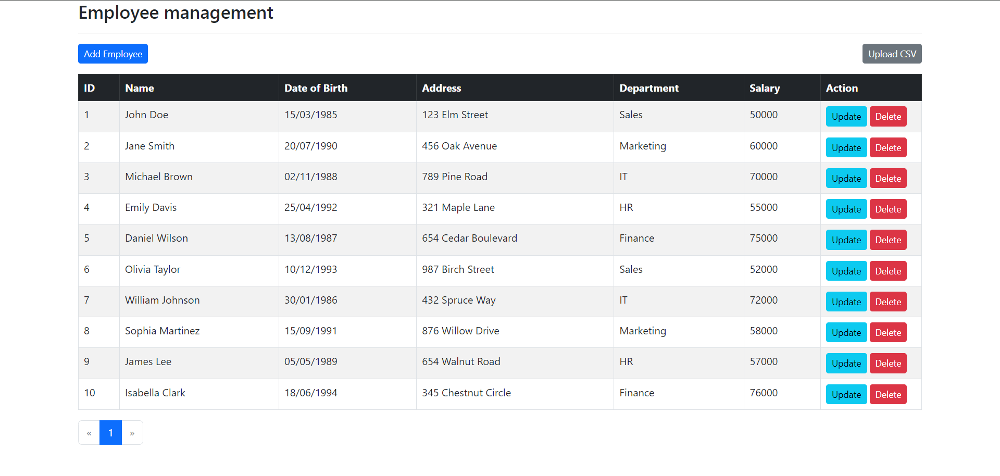
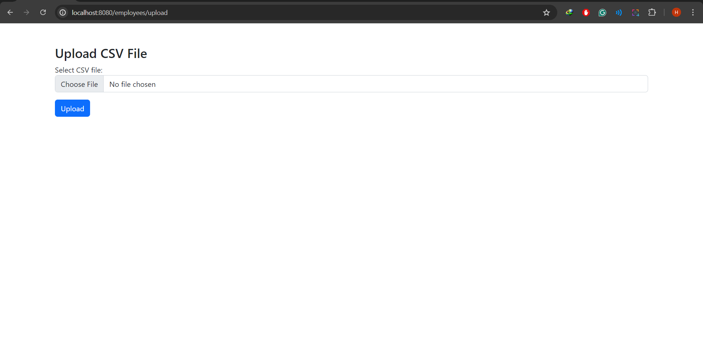

# Assignment 2: Store CSV to Database

Continuing from previous assginment, we will make the project be able to upload a csv file and store it to database

## Init Database

```sql
	DROP TABLE IF EXISTS `employee`;

	CREATE TABLE `employee` (
								`id` int NOT NULL AUTO_INCREMENT,
								name VARCHAR(255),
								dob DATE,
								address VARCHAR(255),
								department VARCHAR(255),
								salary int,
								PRIMARY KEY (`id`)
	) ENGINE=InnoDB AUTO_INCREMENT=1 DEFAULT CHARSET=latin1;

	-- employee
	-- Data for table `employee`
	--

	INSERT INTO `employee` (`name`, `dob`, `address`, `department`, `salary`) VALUES
	('John Doe', '1985-03-15', '123 Elm Street', 'Sales', 50000),
	('Jane Smith', '1990-07-20', '456 Oak Avenue', 'Marketing', 60000),
	('Michael Brown', '1988-11-02', '789 Pine Road', 'IT', 70000),
	('Emily Davis', '1992-04-25', '321 Maple Lane', 'HR', 55000),
	('Daniel Wilson', '1987-08-13', '654 Cedar Boulevard', 'Finance', 75000),
	('Olivia Taylor', '1993-12-10', '987 Birch Street', 'Sales', 52000),
	('William Johnson', '1986-01-30', '432 Spruce Way', 'IT', 72000),
	('Sophia Martinez', '1991-09-15', '876 Willow Drive', 'Marketing', 58000),
	('James Lee', '1989-05-05', '654 Walnut Road', 'HR', 57000),
	('Isabella Clark', '1994-06-18', '345 Chestnut Circle', 'Finance', 76000);
```

## Application.properties

```java
spring.application.name=assignment2
spring.datasource.driver-class-name=com.mysql.jdbc.Driver
spring.datasource.url=jdbc:mysql://localhost:3306/<your_database>
spring.datasource.username=<your_username>
spring.datasource.password=<your_password>

spring.servlet.multipart.max-file-size=100MB
spring.servlet.multipart.max-request-size=100MB
```

## Upload CSV File

### Controller for File Upload

```java
package lecture9.assignment2.controller;

import lecture9.assignment2.model.Employee;
import lecture9.assignment2.service.EmployeeService;
import org.springframework.beans.factory.annotation.Autowired;
import org.springframework.stereotype.Controller;
import org.springframework.ui.Model;
import org.springframework.web.bind.annotation.GetMapping;
import org.springframework.web.bind.annotation.PostMapping;
import org.springframework.web.bind.annotation.RequestParam;
import org.springframework.web.multipart.MultipartFile;

import java.io.BufferedReader;
import java.io.InputStreamReader;
import java.text.SimpleDateFormat;
import java.util.ArrayList;
import java.util.List;

@Controller
public class EmployeeController {

    @Autowired
    private EmployeeService employeeService;

        @PostMapping("/upload")
    public String uploadCSVFile(@RequestParam("file") MultipartFile file, Model model) {
        if (file.isEmpty()) {
            model.addAttribute("message", "Please select a CSV file to upload.");
            return "employees/upload-form";
        }

        try (BufferedReader reader = new BufferedReader(new InputStreamReader(file.getInputStream()))) {
            CSVParser parser = CSVFormat.DEFAULT.withHeader("ID", "Name", "DateOfBirth", "Address", "Department", "Salary").withSkipHeaderRecord(true).parse(reader);
            for (CSVRecord record : parser) {
                if (record.isConsistent() && record.size() == 6) {
                    try {
                        Employee employee = new Employee();
                        employee.setId(Long.parseLong(record.get("ID").replace("ABC_", "")));
                        employee.setName(record.get("Name"));
                        employee.setDob(new SimpleDateFormat("dd/MM/yyyy").parse(record.get("DateOfBirth")));
                        employee.setAddress(record.get("Address"));
                        employee.setDepartment(record.get("Department"));
                        employee.setSalary(Integer.parseInt(record.get("Salary")));
                        employeeService.save(employee);
                    } catch (ParseException e) {
                        logger.error("Error parsing date for record: {}", record, e);
                        model.addAttribute("message", "Error parsing date for record: " + record);
                        return "employees/upload-form";
                    } catch (NumberFormatException e) {
                        logger.error("Error parsing number for record: {}", record, e);
                        model.addAttribute("message", "Error parsing number for record: " + record);
                        return "employees/upload-form";
                    }
                } else {
                    logger.error("Inconsistent record: {}", record);
                    model.addAttribute("message", "Inconsistent record: " + record);
                    return "employees/upload-form";
                }
            }
            model.addAttribute("message", "File uploaded successfully.");
        } catch (IOException e) {
            logger.error("Error reading file", e);
            model.addAttribute("message", "An error occurred while processing the file.");
        }

        model.addAttribute("message", "File uploaded successfully.");
        return "redirect:/employees/list?success";
    }
}

```

**Explanation**:
- **@PostMapping("/upload")**: Handles POST requests to the `/upload` endpoint.
- **@RequestParam("file") MultipartFile file**: Retrieves the uploaded file from the request.
- **Model model**: Used to add attributes to the model which will be available in the web page.
- **if (file.isEmpty())**: Checks if the uploaded file is empty.
  - If empty, adds an error message to the model and returns to the upload form page.
- **try (BufferedReader reader = new BufferedReader(new InputStreamReader(file.getInputStream())))**: Reads the contents of the CSV file.
- **CSVParser parser = CSVFormat.DEFAULT.withHeader("ID", "Name", "DateOfBirth", "Address", "Department", "Salary").withSkipHeaderRecord(true).parse(reader)**: Parses the CSV file with specified headers and skips the header row.
- **for (CSVRecord record : parser)**: Iterates through each record in the CSV file.
  - **if (record.isConsistent() && record.size() == 6)**: Checks if the record is consistent and has 6 columns.
    - **try { ... } catch (ParseException e) { ... } catch (NumberFormatException e) { ... }**: Catches exceptions that may occur while parsing date or number.
    - **Employee employee = new Employee()**: Creates a new Employee object.
    - **employeeService.save(employee)**: Saves the Employee object to the database.
- **model.addAttribute("message", "File uploaded successfully.")**: Adds a success message to the model.
- **return "redirect:/employees/list?success"**: Redirects to the employee list page with a success parameter after successfully uploading.

## Folder Structure
```
assignment2/
├── src/
│   ├── main/
│   │   ├── java/
│   │   │   ├── lecture9/
│   │   │   │   ├── assignment2/
│   │   │   │   │   ├── controller/
│   │   │   │   │   │   └── EmployeeController.java
│   │   │   │   │   ├── model/
│   │   │   │   │   │   └── Employee.java
│   │   │   │   │   ├── repository/
│   │   │   │   │   │   └── EmployeeRepository.java
│   │   │   │   │   ├── service/
│   │   │   │   │   │   ├── EmployeeService.java
│   │   │   │   │   │   └── impl/
│   │   │   │   │   │       └── EmployeeServiceImpl.java
│   │   │   │   │   └── Assignment2Application.java
│   ├── resources/
│   │   ├── templates/
│   │   │   ├── employees/
│   │   │   │   ├── list-employees.html
│   │   │   │   ├── upload-form.html
│   │   │   │   └── employee-form.html
│   │   └── application.properties
│   ├── test/
│      ├── java/
│         └── lecture9/
│             └── assignment2/
│                 └── EmployeeManagementSystemApplicationTests.java
│   
│       
├── .gitignore
├── mvnw
├── mvnw.cmd
└── pom.xml
```

## Run Application

To run the application you can use terminal and run these commands:

Run mvn clean install to build the application.


```
$ mvn clean install
```
Run the Spring Boot application.

```
$ mvn spring-boot:run
```
Open localhost:8080 to see the application.

## Screenshot

### Show all employees


### Upload CSV


### Succesfull Upload
