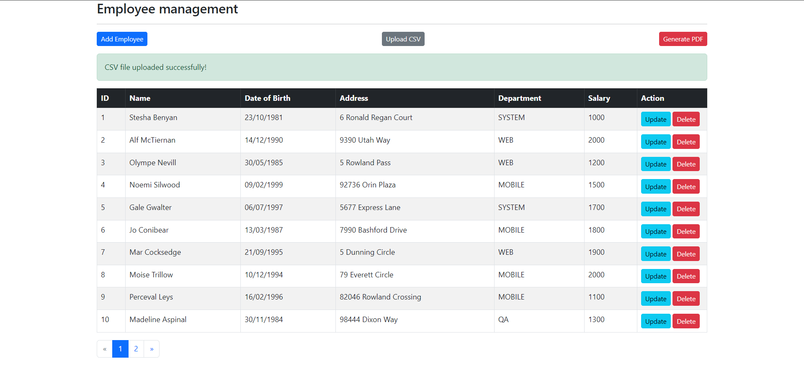
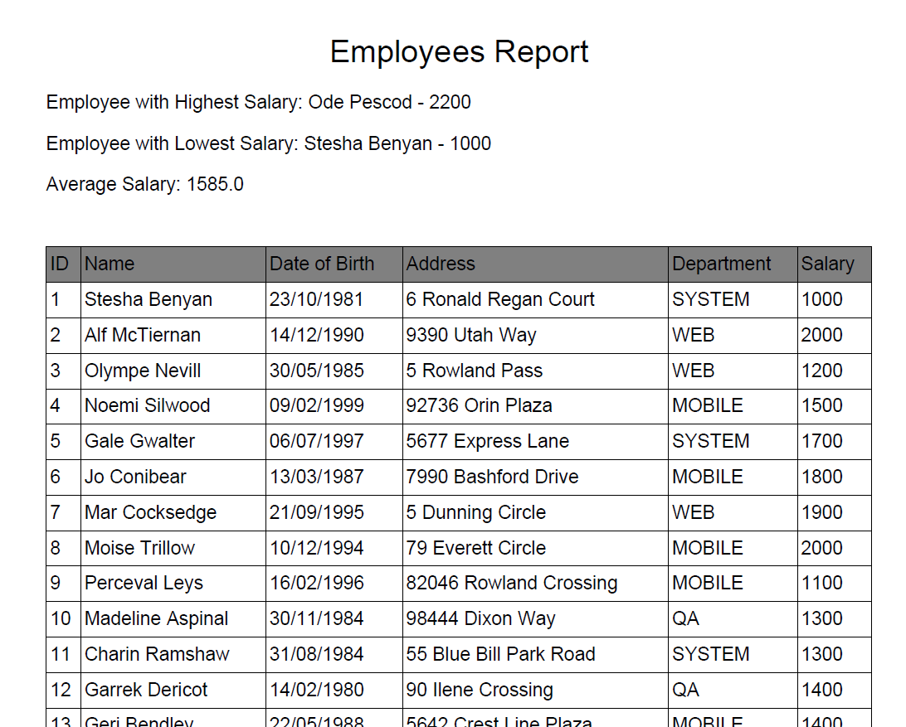

# Assignment 3: Export Employee Data as PDF File

Continuing from previous assginment, we will make the project be able to export the employees data as a pdf file.

## Init Database

```sql
	DROP TABLE IF EXISTS `employee`;

	CREATE TABLE `employee` (
								`id` int NOT NULL AUTO_INCREMENT,
								name VARCHAR(255),
								dob DATE,
								address VARCHAR(255),
								department VARCHAR(255),
								salary int,
								PRIMARY KEY (`id`)
	) ENGINE=InnoDB AUTO_INCREMENT=1 DEFAULT CHARSET=latin1;

	-- employee
	-- Data for table `employee`
	--

	INSERT INTO `employee` (`name`, `dob`, `address`, `department`, `salary`) VALUES
	('John Doe', '1985-03-15', '123 Elm Street', 'Sales', 50000),
	('Jane Smith', '1990-07-20', '456 Oak Avenue', 'Marketing', 60000),
	('Michael Brown', '1988-11-02', '789 Pine Road', 'IT', 70000),
	('Emily Davis', '1992-04-25', '321 Maple Lane', 'HR', 55000),
	('Daniel Wilson', '1987-08-13', '654 Cedar Boulevard', 'Finance', 75000),
	('Olivia Taylor', '1993-12-10', '987 Birch Street', 'Sales', 52000),
	('William Johnson', '1986-01-30', '432 Spruce Way', 'IT', 72000),
	('Sophia Martinez', '1991-09-15', '876 Willow Drive', 'Marketing', 58000),
	('James Lee', '1989-05-05', '654 Walnut Road', 'HR', 57000),
	('Isabella Clark', '1994-06-18', '345 Chestnut Circle', 'Finance', 76000);
```

## Application.properties

```java
spring.application.name=assignment2
spring.datasource.driver-class-name=com.mysql.jdbc.Driver
spring.datasource.url=jdbc:mysql://localhost:3306/<your_database>
spring.datasource.username=<your_username>
spring.datasource.password=<your_password>

spring.servlet.multipart.max-file-size=100MB
spring.servlet.multipart.max-request-size=100MB
```

## Generate PDF

### Controller

```java
@GetMapping("/generate-pdf")
    public ResponseEntity<InputStreamResource> generatePDF() throws IOException {
        List<Employee> employees = employeeService.findAll();
        ByteArrayInputStream bis = PDFGenerator.generateEmployeePDF(employees);

        HttpHeaders headers = new HttpHeaders();
        headers.add("Content-Disposition", "inline; filename=employees.pdf");

        return ResponseEntity
                .ok()
                .headers(headers)
                .contentType(MediaType.APPLICATION_PDF)
                .body(new InputStreamResource(bis));
    }
```

**Explanation**:
- **@GetMapping("/generate-pdf")**: Handles GET requests to the `/generate-pdf` endpoint.
- **public ResponseEntity<InputStreamResource> generatePDF() throws IOException**: Defines a method that returns a PDF document as a response.
- **List<Employee> employees = employeeService.findAll()**: Retrieves a list of all employees from the database using the `employeeService`.
- **ByteArrayInputStream bis = PDFGenerator.generateEmployeePDF(employees)**: Generates a PDF document from the list of employees using a `PDFGenerator` utility class and stores the PDF data in a `ByteArrayInputStream`.
- **HttpHeaders headers = new HttpHeaders()**: Creates an instance of `HttpHeaders`.
- **headers.add("Content-Disposition", "inline; filename=employees.pdf")**: Adds a header to the response to indicate that the PDF should be displayed inline in the browser with the filename `employees.pdf`.
- **return ResponseEntity.ok().headers(headers).contentType(MediaType.APPLICATION_PDF).body(new InputStreamResource(bis))**: Constructs a `ResponseEntity` object:
  - **ok()**: Sets the HTTP status to 200 OK.
  - **headers(headers)**: Adds the previously defined headers to the response.
  - **contentType(MediaType.APPLICATION_PDF)**: Sets the content type of the response to PDF.
  - **body(new InputStreamResource(bis))**: Sets the body of the response to the PDF data encapsulated in an `InputStreamResource`.

### PDF Generator Util

to make the pdf file, we will need to make a util for generating the pdf file
```java
package lecture9.assignment3.util;

import com.itextpdf.kernel.colors.DeviceGray;
import com.itextpdf.kernel.pdf.PdfDocument;
import com.itextpdf.kernel.pdf.PdfWriter;
import com.itextpdf.layout.Document;
import com.itextpdf.layout.element.Cell;
import com.itextpdf.layout.element.Paragraph;
import com.itextpdf.layout.element.Table;
import com.itextpdf.layout.property.TextAlignment;
import com.itextpdf.layout.property.UnitValue;

import lecture9.assignment3.model.Employee;

import java.io.ByteArrayInputStream;
import java.io.ByteArrayOutputStream;
import java.io.IOException;
import java.text.SimpleDateFormat;
import java.util.List;

public class PDFGenerator {

    public static ByteArrayInputStream generateEmployeePDF(List<Employee> employees) throws IOException {
        ByteArrayOutputStream out = new ByteArrayOutputStream();

        PdfWriter writer = new PdfWriter(out);
        PdfDocument pdfDoc = new PdfDocument(writer);
        Document document = new Document(pdfDoc);

        // Header
        Paragraph header = new Paragraph("Employees Report")
                .setTextAlignment(TextAlignment.CENTER)
                .setFontSize(20);
        document.add(header);

        // Calculations
        Employee highestSalaryEmployee = employees.stream().max((e1, e2) -> e1.getSalary() - e2.getSalary()).orElse(null);
        Employee lowestSalaryEmployee = employees.stream().min((e1, e2) -> e1.getSalary() - e2.getSalary()).orElse(null);
        double averageSalary = employees.stream().mapToInt(Employee::getSalary).average().orElse(0);

        document.add(new Paragraph("Employee with Highest Salary: " + highestSalaryEmployee.getName() + " - " + highestSalaryEmployee.getSalary()));
        document.add(new Paragraph("Employee with Lowest Salary: " + lowestSalaryEmployee.getName() + " - " + lowestSalaryEmployee.getSalary()));
        document.add(new Paragraph("Average Salary: " + averageSalary));

        document.add(new Paragraph("\n")); // Adding space between calculations and table

        // Employee Table
        Table table = new Table(new float[]{1, 3, 3, 3, 3, 2});
        table.setWidth(UnitValue.createPercentValue(100));
        
        table.addHeaderCell(new Cell().add(new Paragraph("ID")).setBackgroundColor(DeviceGray.GRAY));
        table.addHeaderCell(new Cell().add(new Paragraph("Name")).setBackgroundColor(DeviceGray.GRAY));
        table.addHeaderCell(new Cell().add(new Paragraph("Date of Birth")).setBackgroundColor(DeviceGray.GRAY));
        table.addHeaderCell(new Cell().add(new Paragraph("Address")).setBackgroundColor(DeviceGray.GRAY));
        table.addHeaderCell(new Cell().add(new Paragraph("Department")).setBackgroundColor(DeviceGray.GRAY));
        table.addHeaderCell(new Cell().add(new Paragraph("Salary")).setBackgroundColor(DeviceGray.GRAY));

        SimpleDateFormat dateFormat = new SimpleDateFormat("dd/MM/yyyy");

        for (Employee employee : employees) {
            table.addCell(new Cell().add(new Paragraph(employee.getId().toString())));
            table.addCell(new Cell().add(new Paragraph(employee.getName())));
            table.addCell(new Cell().add(new Paragraph(dateFormat.format(employee.getDob()))));
            table.addCell(new Cell().add(new Paragraph(employee.getAddress())));
            table.addCell(new Cell().add(new Paragraph(employee.getDepartment())));
            table.addCell(new Cell().add(new Paragraph(String.valueOf(employee.getSalary()))));
        }

        document.add(table);

        document.close();

        return new ByteArrayInputStream(out.toByteArray());
    }
}

```

## Folder Structure

```
assignment3/
├── src/
│   ├── main/
│   │   ├── java/
│   │   │   └── lecture9/
│   │   │       └── assignment3/
│   │   │           ├── Assignment3Application.java
│   │   │           ├── controller/
│   │   │           │   └── EmployeeController.java
│   │   │           ├── model/
│   │   │           │   └── Employee.java
│   │   │           ├── repository/
│   │   │           │   └── EmployeeRepository.java
│   │   │           ├── service/
│   │   │           │   ├── EmployeeService.java
│   │   │           │   └── impl/
│   │   │           │       └── EmployeeServiceImpl.java
│   │   │           └── util/
│   │   │               └── PDFGenerator.java
│   │   ├── resources/
│   │   │   ├── static/
│   │   │   ├── templates/
│   │   │   │   ├── employees/
│   │   │   │   │   ├── list-employees.html
│   │   │   │   │   ├── upload-form.html
│   │   │   │   │   ├── employee-form.html
│   │   │   │   └── index.html
│   │   │   ├── application.properties
│   │   │   
│   ├── test/
│   │   └── java/
│   │       └── lecture9/
│   │           └── assignment3/
│   │               └── Assignment3ApplicationTests.java
└── pom.xml
```

## Run Application

To run the application you can use terminal and run these commands:

Run mvn clean install to build the application.


```
$ mvn clean install
```
Run the Spring Boot application.

```
$ mvn spring-boot:run
```
Open localhost:8080 to see the application.

## Screenshot

### Show all employees


### Generated PDF File

