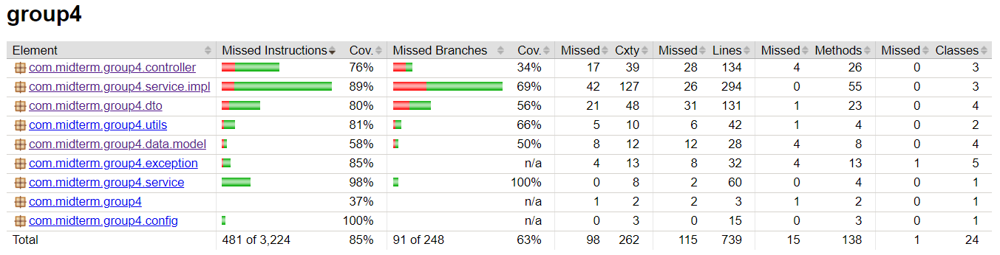
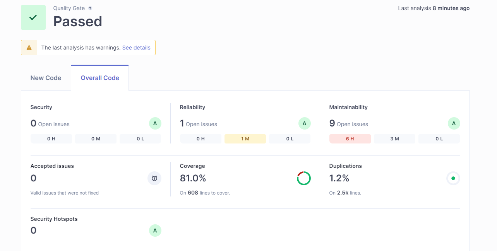

# Assignment Week 9 - Ensure Code Quality

Ensuring code quality in Java through unit testing involves writing isolated tests for individual methods or functions to verify their correctness, catching bugs early in development, and preventing regressions as the code evolves. These tests promote better code design by encouraging modularity and reducing dependencies, ultimately leading to a more maintainable and robust codebase. 

In this assignment we will perform unit testing on midterm exam using **JaCoCo** and **SonarQube**

## JaCoCo

JaCoCo (Java Code Coverage) is a widely used tool for measuring the code coverage of Java applications. It analyzes which parts of your code are being tested by your unit tests, providing metrics like line coverage, branch coverage, and method coverage. By integrating JaCoCo into your build process (e.g., using Maven or Gradle), you can generate detailed reports that highlight untested parts of your code, allowing you to improve test coverage and ensure more thorough testing.

### Result

This **JaCoCo** report shows an overall code coverage of 85% for the com.midterm.group4 package, with detailed breakdowns across various components. Overall, while most components have decent coverage, some areas, especially in branch coverage, need improvement to ensure comprehensive testing.

## SonarQube

**SonarQube** is a comprehensive code quality management tool that analyzes your codebase for various quality issues, including bugs, vulnerabilities, code smells, and security hotspots. It integrates with your CI/CD pipeline to continuously inspect code quality as it is developed, providing detailed dashboards and metrics on code quality. SonarQube also supports code coverage analysis by integrating with tools like JaCoCo, enabling you to see the correlation between test coverage and code quality. Additionally, SonarQube enforces coding standards and best practices, helping teams maintain high-quality code over time.

### Result

This SonarQube report indicates that the project's overall code quality has passed the quality gate, with no security vulnerabilities or hotspots detected, and only one minor reliability issue. The code maintainability is good, with nine open issues, primarily minor, resulting in 6 hours of estimated technical debt. Code coverage is at 81%, meaning that 81% of the code is covered by tests, while the duplication rate is low at 1.2% across 2.5k lines. Despite some minor warnings, the project is in good health with acceptable levels of reliability, maintainability, and code coverage.