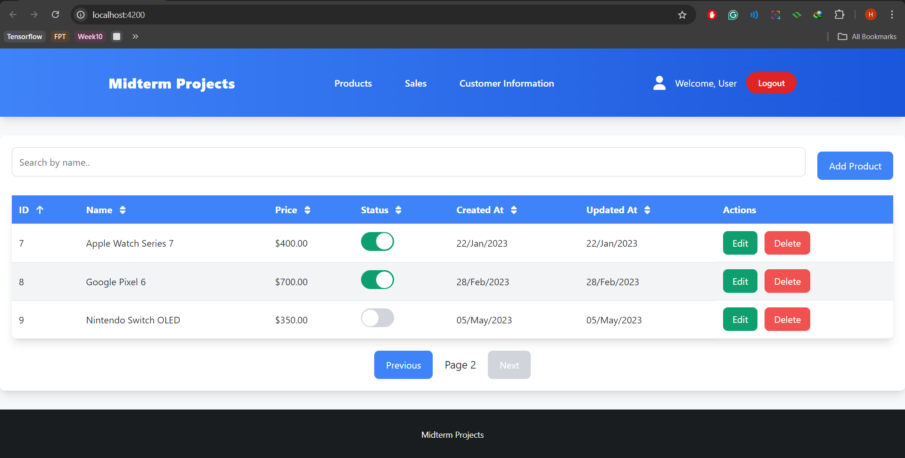
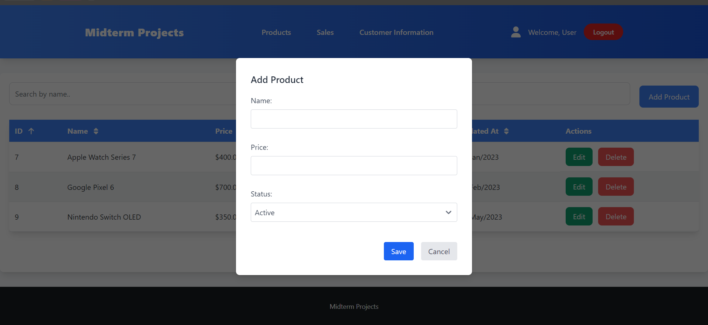
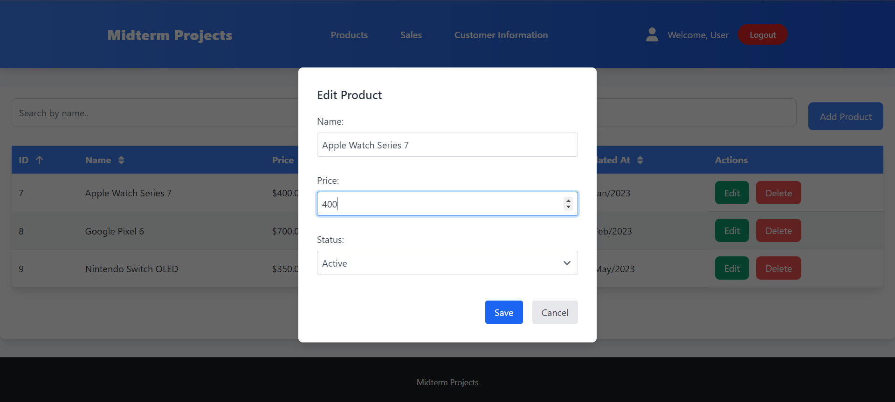
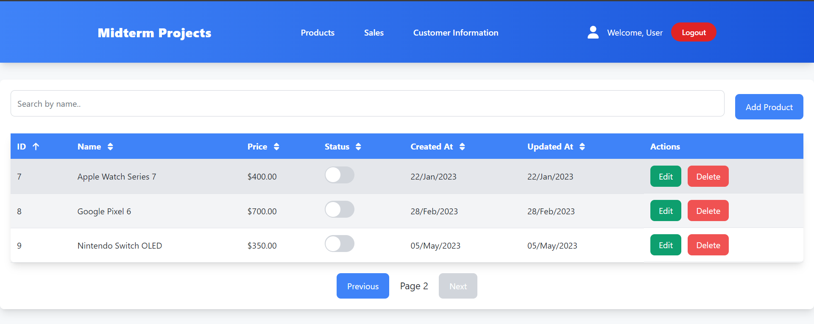

# Assignment 21: Basic Angular

In this assignment we will revisit our midterm project and make a **base project structure** for the midterm projects in angular. The requirements are:

- List product: id, name, price, status,.... Search by name, sort by name or price (pagination)
- Add new product (reactive form)
- Edit product
- Activate / deactivate product (toggle each row and in product detail page)

>*P.S Need not to integrate with api in this week

## Implementation

### 1. List of products

### 2. Add product

### 3. Edit Product

### 4. Activate / Deactivate Product

