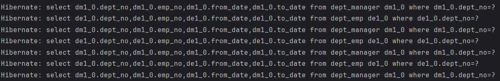

# Assignment 1: Spring Data JPA

In this assignment we will make a Spring Boot project application that manages employees, departments, salaries, and titles. It uses Spring Data JPA for database operations and connects to a MySQL database. We will also implement hibernates to see the queries used and we will implement composite key

## Hibernate

Hibernate is an object-relational mapping (ORM) framework for Java. It simplifies the development of Java applications to interact with databases by mapping Java objects to database tables. Hibernate handles the conversion between the object-oriented world of Java and the relational world of databases, allowing developers to work with Java objects rather than SQL statements.

### Key Features of Hibernate:

1. **Automatic Table Creation**: Hibernate can automatically create tables based on your entity classes.
2. **HQL (Hibernate Query Language)**: A powerful query language similar to SQL, but it works with Java objects.
3. **Caching**: Improves performance by caching frequently accessed data.
4. **Lazy Loading**: Fetches data only when needed.
5. **Transaction Management**: Simplifies complex transaction management.
6. **Annotations and XML Configuration**: Supports both annotations and XML configuration for mapping.
7. **Integration**: Integrates with various Java frameworks and tools like Spring, JPA, etc.

### Example


## Composite Key

A composite key is a primary key that consists of two or more columns. Each column that makes up the composite key is a foreign key in its own right, but together they uniquely identify each record in a table. Composite keys are used in many-to-many relationships and in situations where a single column is not sufficient to ensure the uniqueness of a record.

### Composite Key in Hibernate:

To define a composite key in Hibernate, you typically use the `@Embeddable` and `@EmbeddedId` annotations.

1. **@Embeddable**: This annotation is used to specify a class whose instances are stored as an intrinsic part of an owning entity and share the identity of the entity.
2. **@EmbeddedId**: This annotation is used to specify the composite primary key.

### Example:

```java
@Embeddable
public class SalaryId implements Serializable {
    private int empNo;
    private Date fromDate;
    
    // getters, setters, hashCode, equals
}

@Entity
@Table(name = "salaries")
public class Salary {
    @EmbeddedId
    private SalaryId id;

    @Column(name = "salary")
    private int salary;

    @Column(name = "to_date")
    private Date toDate;

    @ManyToOne
    @MapsId("empNo")
    @JoinColumn(name = "emp_no")
    private Employee employee;
    
    // getters, setters
}
```

In this example:
- `SalaryId` is an embeddable class representing the composite key.
- `Salary` uses `SalaryId` as its primary key with the `@EmbeddedId` annotation.

## Running the Project

### 1. Setup the database

Create a MySQL database and run the following SQL scripts to set up the necessary tables and insert mock data.

```sql
CREATE TABLE employees (
    emp_no INT AUTO_INCREMENT,
    birth_date DATE,
    first_name VARCHAR(50),
    last_name VARCHAR(50),
    gender ENUM('M', 'F'),
    hire_date DATE,
    PRIMARY KEY (emp_no)
);

CREATE TABLE departments (
    dept_no CHAR(4),
    dept_name VARCHAR(40),
    PRIMARY KEY (dept_no)
);

CREATE TABLE dept_emp (
    emp_no INT,
    dept_no CHAR(4),
    from_date DATE,
    to_date DATE,
    PRIMARY KEY (emp_no, dept_no),
    FOREIGN KEY (emp_no) REFERENCES employees(emp_no),
    FOREIGN KEY (dept_no) REFERENCES departments(dept_no)
);

CREATE TABLE dept_manager (
    emp_no INT,
    dept_no CHAR(4),
    from_date DATE,
    to_date DATE,
    PRIMARY KEY (emp_no, dept_no),
    FOREIGN KEY (emp_no) REFERENCES employees(emp_no),
    FOREIGN KEY (dept_no) REFERENCES departments(dept_no)
);

CREATE TABLE salaries (
    emp_no INT,
    from_date DATE,
    to_date DATE,
    salary INT,
    PRIMARY KEY (emp_no, from_date),
    FOREIGN KEY (emp_no) REFERENCES employees(emp_no)
);

CREATE TABLE titles (
    emp_no INT,
    title VARCHAR(50),
    from_date DATE,
    to_date DATE,
    PRIMARY KEY (emp_no, from_date, title),
    FOREIGN KEY (emp_no) REFERENCES employees(emp_no)
);

-- Insert mock data
INSERT INTO employees (birth_date, first_name, last_name, gender, hire_date) VALUES
('1979-01-01', 'John', 'Doe', 'M', '2019-01-01'),
('1985-05-15', 'Jane', 'Smith', 'F', '2020-06-15');

INSERT INTO departments (dept_no, dept_name) VALUES
('d001', 'Engineering'),
('d002', 'HR'),
('d003', 'Finance');

INSERT INTO dept_emp (emp_no, dept_no, from_date, to_date) VALUES
(1, 'd001', '2019-01-01', '2022-01-01'),
(2, 'd002', '2020-06-15', '2023-06-15');

INSERT INTO dept_manager (emp_no, dept_no, from_date, to_date) VALUES
(1, 'd001', '2019-01-01', '2022-01-01'),
(2, 'd002', '2020-06-15', '2023-06-15');

INSERT INTO salaries (emp_no, from_date, to_date, salary) VALUES
(1, '2019-01-01', '2022-01-01', 50000),
(2, '2020-06-15', '2023-06-15', 60000);

INSERT INTO titles (emp_no, title, from_date, to_date) VALUES
(1, 'Engineer', '2019-01-01', '2022-01-01'),
(2, 'Manager', '2020-06-15', '2023-06-15');
```

### 2. Configure the application properties

Update the `application.properties` file with your MySQL database credentials.

```properties
spring.application.name=assignment1
spring.datasource.url=jdbc:mysql://localhost:3306/your_database
spring.datasource.username=your_username
spring.datasource.password=your_password
spring.datasource.driver-class-name=com.mysql.cj.jdbc.Driver

spring.jpa.hibernate.ddl-auto=update
spring.jpa.show-sql=true
spring.jpa.properties.hibernate.dialect=org.hibernate.dialect.MySQL8Dialect

spring.http.encoding.enabled=true
spring.http.encoding.charset=UTF-8
spring.http.encoding.force=true
```

### 3. Build and run the application

Use Maven to build and run the application.

```bash
mvn clean install
mvn spring-boot:run
```

### 4. Testing the API

You can use Postman or any other API testing tool to interact with the endpoints. you can use the postman collection