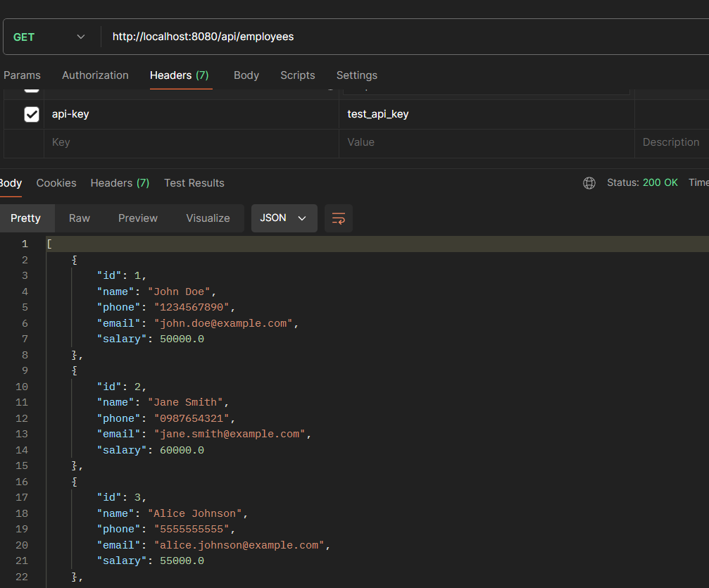
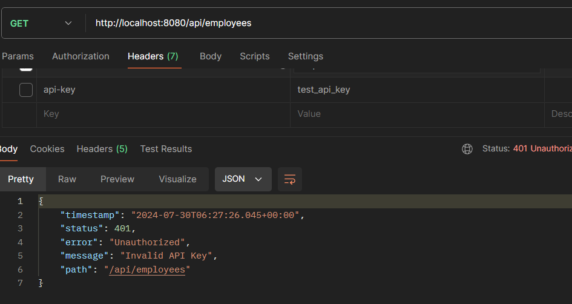

# Assignment 2: Simple Filter

In this assignment we will create a simple CRUD project with a twist, we will implement simple filter in this project. A filter in a Spring Boot application is used to intercept and process HTTP requests and responses. This can be useful for tasks such as authentication, logging, or adding custom headers. In this assignment, we need to implement a filter that validates API keys and adds a custom header to all responses.

## Steps to Implement the Simple Filter

### 1. Database Setup


```sql
CREATE TABLE employee (
    id BIGINT NOT NULL AUTO_INCREMENT,
    name VARCHAR(255) NOT NULL,
    phone VARCHAR(20),
    email VARCHAR(255),
    salary DECIMAL(10, 2),
    PRIMARY KEY (id)
);

INSERT INTO employee (name, phone, email, salary) VALUES
('John Doe', '1234567890', 'john.doe@example.com', 50000.00),
('Jane Smith', '0987654321', 'jane.smith@example.com', 60000.00),
('Alice Johnson', '5555555555', 'alice.johnson@example.com', 55000.00),
('Bob Brown', '4444444444', 'bob.brown@example.com', 45000.00);

CREATE TABLE api_keys (
    id BIGINT NOT NULL AUTO_INCREMENT,
    key_value VARCHAR(255) NOT NULL,
    PRIMARY KEY (id),
    UNIQUE (key_value)

INSERT INTO api_keys (key_value) VALUES ('test_api_key');
```

### 2. Implement the Filter Logic

#### a. Intercept Requests

- The filter should intercept incoming HTTP requests to specific URL patterns (e.g., `/api/*`).
- Extract the API key from the request headers.

#### b. Validate API Key

- Check if the extracted API key exists in the database.
- If the API key is valid, allow the request to proceed to the next filter or the targeted endpoint.
- If the API key is invalid, respond with an error (e.g., 401 Unauthorized).

#### c. Modify Responses

- Add a custom header to every HTTP response.

### 3. Spring Boot Project Setup

#### a. Project Setup

- Create a new Spring Boot project.
- Include the necessary dependencies (e.g., Spring Data JPA, MySQL driver, Lombok).

#### b. Define Entities

- Define the `Employee` and `ApiKey` entities to map to the respective database tables.

#### c. Create Repositories

- Create `EmployeeRepository` for CRUD operations on `Employee`.
- Create `ApiKeyRepository` for API key validation.

#### d. Implement Services

- Implement a service to handle business logic for `Employee`.
- Implement a service to validate API keys against the database.

#### e. Define the Filter

- Implement the filter to perform the tasks mentioned (intercept, validate, modify).

#### f. Register the Filter

- Register the filter with the Spring Boot application so it intercepts requests to the specified URL patterns.

### 4. Folder Structure

```commandline
project-root/
├── src/
│   ├── main/
│   │   ├── java/
│   │   │   └── com/
│   │   │       └── example/
│   │   │           └── demo/
│   │   │               ├── DemoApplication.java
│   │   │               ├── config/
│   │   │               │   └── WebConfig.java
│   │   │               ├── controller/
│   │   │               │   └── EmployeeController.java
│   │   │               ├── filter/
│   │   │               │   └── ApiKeyFilter.java
│   │   │               ├── model/
│   │   │               │   ├── Employee.java
│   │   │               │   └── ApiKey.java
│   │   │               ├── repository/
│   │   │               │   ├── EmployeeRepository.java
│   │   │               │   └── ApiKeyRepository.java
│   │   │               └── service/
│   │   │                   ├── EmployeeService.java
│   │   │                   └── ApiKeyService.java
│   │   ├── resources/
│   │   │   ├── application.properties
│   │   │   └── schema.sql
│   └── test/
│       └── java/
│           └── com/
│               └── example/
│                   └── demo/
│                       └── DemoApplicationTests.java
├── .gitignore
└── pom.xml
```

### 5. Testing the Filter

Send requests to the application endpoints with and without the API key header.

**With Header**



**Without Header / Wrong Api Key**




