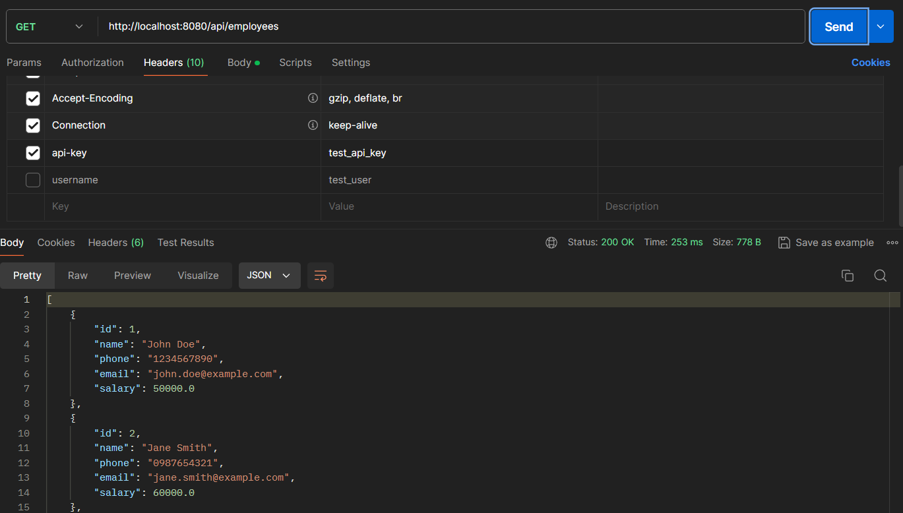

# Assignment 3: Simple Interceptor

In this Assignment, we will continue from the previous assignment where we will make a project to implement a mechanism to handle API requests, but in this assignment we will implement different requirements for GET and POST methods. Specifically: Use a `filter` to validate API keys for all GET requests.
 and Use an `interceptor` to enforce the presence of a username for all POST requests and to add a timestamp to the response headers for all responses.

## Components Involved

1. **ApiKeyFilter**: A filter that validates the presence and correctness of an API key for GET requests.
2. **RequestInterceptor**: An interceptor that checks for the presence of a username in POST requests and adds a timestamp to all responses.

## Detailed Steps and Code Explanation

### 1. ApiKeyFilter

The `ApiKeyFilter` is responsible for validating the API key for all incoming GET requests. If the API key is missing or invalid, it returns a 401 Unauthorized response.

**Key Points in `ApiKeyFilter`:**
- The filter extends `OncePerRequestFilter` to ensure it is executed once per request.
- It checks if the request method is GET.
- It retrieves the API key from the request headers and validates it using the `ApiKeyService`.

**Code Snippet:**
```java
@Component
public class ApiKeyFilter extends OncePerRequestFilter {

    @Autowired
    private ApiKeyService apiKeyService;

    @Override
    protected void doFilterInternal(HttpServletRequest request, HttpServletResponse response, FilterChain filterChain) throws ServletException, IOException {
        if ("GET".equalsIgnoreCase(request.getMethod())) {
            String apiKey = request.getHeader("api-key");
            if (apiKey == null || !apiKeyService.isValidApiKey(apiKey)) {
                response.setStatus(HttpServletResponse.SC_UNAUTHORIZED);
                response.getWriter().write("{\"timestamp\": \"" + LocalDateTime.now() + "\", \"status\": 401, \"error\": \"Unauthorized\", \"message\": \"Invalid API Key\", \"path\": \"" + request.getRequestURI() + "\"}");
                return;
            }
        }
        filterChain.doFilter(request, response);
    }
}
```

**Explanation:**
- The `doFilterInternal` method checks if the request method is GET.
- If it is, it retrieves the `api-key` from the headers and validates it using the `ApiKeyService`.
- If the API key is invalid or missing, it returns a 401 Unauthorized response with a JSON error message.

### 2. RequestInterceptor

The `RequestInterceptor` ensures that POST requests contain a `username` header and adds a timestamp to all responses.

**Key Points in `RequestInterceptor`:**
- The interceptor implements `HandlerInterceptor` to intercept requests.
- It checks if the request method is POST and validates the presence of the `username` header.
- It adds a timestamp to all responses in the `afterCompletion` method.

**Code Snippet:**
```java
@Component
public class RequestInterceptor implements HandlerInterceptor {

    @Override
    public boolean preHandle(HttpServletRequest request, HttpServletResponse response, Object handler) throws IOException {
        if ("POST".equalsIgnoreCase(request.getMethod())) {
            String username = request.getHeader("username");
            if (username == null || username.isEmpty()) {
                response.setStatus(HttpServletResponse.SC_BAD_REQUEST);
                response.getWriter().write("{\"timestamp\": \"" + LocalDateTime.now() + "\", \"status\": 400, \"error\": \"Bad Request\", \"message\": \"Username is required\", \"path\": \"" + request.getRequestURI() + "\"}");
                return false;
            }
        }
        return true;
    }

    @Override
    public void afterCompletion(HttpServletRequest request, HttpServletResponse response, Object handler, Exception ex) {
        response.addHeader("timestamp", LocalDateTime.now().format(DateTimeFormatter.ISO_DATE_TIME));
    }
}
```

**Explanation:**
- The `preHandle` method checks if the request method is POST.
- If it is, it retrieves the `username` from the headers and checks if it is present and not empty.
- If the `username` is missing, it returns a 400 Bad Request response with a JSON error message.
- The `afterCompletion` method adds a `timestamp` header to all responses with the current time.

### 3. Web Configuration

To ensure that the filter and interceptor are applied to the appropriate requests, they need to be registered in the application's web configuration.

**Key Points in `WebConfig`:**
- Register the `ApiKeyFilter` to handle all requests under the `/api/*` path.
- Register the `RequestInterceptor` to handle all requests.

**Code Snippet:**
```java
@Configuration
public class WebConfig implements WebMvcConfigurer {

    @Autowired
    private RequestInterceptor requestInterceptor;

    @Override
    public void addInterceptors(InterceptorRegistry registry) {
        registry.addInterceptor(requestInterceptor).addPathPatterns("/**");
    }

    @Bean
    public FilterRegistrationBean<ApiKeyFilter> apiKeyFilterRegistrationBean(ApiKeyFilter apiKeyFilter) {
        FilterRegistrationBean<ApiKeyFilter> registrationBean = new FilterRegistrationBean<>();
        registrationBean.setFilter(apiKeyFilter);
        registrationBean.addUrlPatterns("/api/*");
        return registrationBean;
    }
}
```

**Explanation:**
- The `addInterceptors` method registers the `RequestInterceptor` to handle all paths (`/**`).
- The `apiKeyFilterRegistrationBean` method registers the `ApiKeyFilter` for all paths under `/api/*`.

## Folder Structure

```commandline
demo
├── src
│   ├── main
│   │   ├── java
│   │   │   └── com
│   │   │       └── example
│   │   │           └── demo
│   │   │               ├── controller
│   │   │               │   └── EmployeeController.java
│   │   │               ├── filter
│   │   │               │   └── ApiKeyFilter.java
│   │   │               ├── interceptor
│   │   │               │   └── PostRequestInterceptor.java
│   │   │               ├── config
│   │   │               │   └── WebConfig.java
│   │   │               ├── service
│   │   │               │   ├── ApiKeyService.java
│   │   │               │   └── EmployeeService.java
│   │   │               ├── model
│   │   │               │   ├── ApiKey.java
│   │   │               │   └── Employee.java
│   │   │               ├── repository
│   │   │               │   ├── ApiKeyRepository.java
│   │   │               │   └── EmployeeRepository.java
│   │   │               └── DemoApplication.java
│   │   ├── resources
│   │   │   └── application.properties
│   ├── test
│   │   └── java
│   │       └── com
│   │           └── example
│   │               └── demo
│   │                   └── DemoApplicationTests.java
├── pom.xml
└── Assignment3_Explanation.md
```

## Testing 

Send requests to the application endpoints with and without the Username header.

### Get without username


### Post without username


### Post with username

